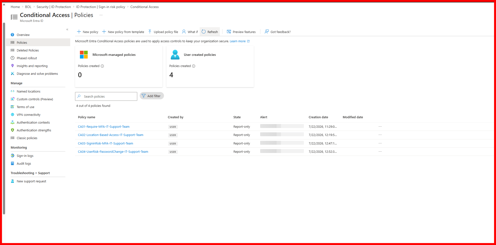

# Zero-to-SOC: A Self-Funded, Multi-Certification Cloud Security Lab

**Building a real, hands-on Microsoft 365 + Azure security and administration environment — end to end, on free-tier and trial subscriptions only — in preparation for Microsoft 365 Administration, SC-200 (Security Operations Analyst), and AZ-104 (Azure Administrator).**

  

---

## Table of contents

- [Why this exists](#why-this-exists)
- [The stack](#the-stack)
- [Project 1 — Environment Setup & Cross-Tenant Recovery](#project-1--environment-setup--cross-tenant-recovery)
- [Project 2 — Tenant, Users & Governance Foundation](#project-2--tenant-users--governance-foundation)
- [Project 3 — Identity Security: MFA, Conditional Access & Identity Protection](#project-3--identity-security-mfa-conditional-access--identity-protection)
- [Key learnings across all three projects](#key-learnings-across-all-three-projects)
- [Roadmap — upcoming projects](#roadmap--upcoming-projects)
- [About](#about)

---

## Why this exists

Certification guides teach concepts in a vacuum. They don't make you sit through a declined card, discover your SIEM is quietly pointed at the wrong tenant, or figure out why a group you just built has zero members. This repository documents, screenshot by screenshot, the actual process of building a functioning multi-cloud security lab from a completely empty account — mistakes, dead ends, and fixes included — rather than a cleaned-up "final state" walkthrough.

Every stage is called a **Project** rather than a "phase" or "module," because that's what it is: a self-contained unit of work with its own goal, its own problems, and its own resolution — the same way real infrastructure work is scoped.

---

## The stack

| Component | Role |
|---|---|
| Microsoft 365 Business Premium (trial) | Core tenant — mail, collaboration, base licensing |
| Microsoft Entra ID P2 (trial) | Identity governance — Conditional Access, Identity Protection, dynamic groups |
| Enterprise Mobility + Security E5 (trial) | Defender for Identity, Defender for Cloud Apps |
| Microsoft Defender for Office 365, Plan 2 (trial) | Email threat protection |
| Microsoft Sentinel (Azure) | SIEM/SOAR — detection engineering, KQL, incident response |
| Azure infrastructure ($200 free credit) | Resource Groups, RBAC, Storage, Networking, Compute |

---

## Project 1 — Environment Setup & Cross-Tenant Recovery

**Goal:** provision every license and service needed for the lab, on trial/free tiers only, with zero ongoing cost.

**📄 Full detail (16 screenshots, every sub-step documented): [`project-1-environment-setup/README.md`](./project-1-environment-setup/README.md)**

This project turned out to be less "click next a few times" and more "diagnose three separate problems in sequence":

- **Provisioned** Azure ($200 credit) and an M365 tenant, then every trial license needed (Business Premium, Entra ID P2, EMS E5, Defender for Office 365 P2)
- **Payment troubleshooting** — a debit card that verified Azure fine was repeatedly declined on Business Premium's recurring-billing model; a dual-currency credit card resolved it on the first attempt
- **Dead end** — the Microsoft 365 Developer Program rejected the account for a card-free sandbox
- **The real problem** — discovered the first Sentinel workspace had been built in a completely different tenant than the one holding every license, since Azure and M365 sign-ins don't make the active tenant obvious
- **Recovery** — rebuilt Sentinel from scratch in the correct tenant and verified all 7 Defender XDR connectors reporting Connected

*The moment that confirmed the rebuild worked — same tenant, fully integrated.*

---

## Project 2 — Tenant, Users & Governance Foundation

**Goal:** populate the now-correctly-scoped tenant with test identities and governance structures, and stand up the equivalent Azure administrative foundation.

**📄 Full detail (26 screenshots, every sub-step documented): [`project-2-governance-foundation/README.md`](./project-2-governance-foundation/README.md)**

Summary of what was built:

- **User provisioning** — 5 test identities with deliberately varied license state, department, and job title (used as test data throughout later projects)
- **Security Group** (assigned membership) — `IT-Support-Team`
- **Microsoft 365 Group** — `Managing-Team`, verified it auto-provisioned a linked Team and SharePoint site
- **Dynamic Group** — a real debugging story: the M365 admin center's group wizard only supports Assigned membership; dynamic rules had to be configured separately in the Entra admin center (`(user.department -eq "IT")`), and membership evaluation turned out to be asynchronous rather than instant
- **Azure governance foundation** — explored the Management Group → Subscription hierarchy, then created a tagged Resource Group (`environment: lab`, `owner: rakibul`) as the scoping unit for every later Azure project

*The one screenshot that matters most from this project — the M365 admin center simply doesn't expose this screen.*

---

## Project 3 — Identity Security: MFA, Conditional Access & Identity Protection

**Goal:** move beyond password-only sign-in by layering per-user MFA, group-scoped Conditional Access, location-based access, and risk-based policies on top of the Project 1–2 tenant — then verify with logs that the policies actually fire.

**📄 Full detail (9 screenshots, every sub-step documented): [`project-3-identity-security/README.md`](./project-3-identity-security/README.md)**

Summary of what was built:

- **Per-user MFA** enabled for test user `Shakhawat Hossian Anik`, as a baseline before moving to Conditional Access
- **CA01** — required MFA for the existing `IT-Support-Team` group (reused rather than duplicated) across all cloud apps
- **CA02** — location-based access: a `Bangladesh-Trusted` named location, MFA required everywhere except it
- **CA03 / CA04** — sign-in risk and user risk policies, rebuilt as Conditional Access after discovering the classic Identity Protection risk policy pages are being retired October 1, 2026
- **Verification** — 5 deliberate failed logins, confirmed end-to-end via Sign-in logs (error `50126`) and the Conditional Access Policy Impact tab, all policies kept in **Report-only** throughout

*CA01 through CA04, all evaluated in Report-only mode before anything gets enforced.*

---

## Key learnings across all three projects

1. **Payment failures can be bank-side, not account-side.** A domestic debit card that verifies a one-time Azure hold can still be blocked on a recurring-billing merchant. A dual-currency credit card resolved it reliably.
2. **Always confirm which tenant is active before provisioning.** Azure and Microsoft 365 sessions can silently diverge into different directories even when the sign-in usernames look identical — this cost an entire rebuild.
3. **The simplified admin UI is not the full picture.** The Microsoft 365 admin center covers common tasks well, but advanced identity governance (dynamic groups, PIM, administrative units) lives in the Entra admin center.
4. **Background processes aren't instant.** Dynamic group membership, license propagation, and connector activation can all take several minutes — don't assume a misconfiguration too early.
5. **Tag at creation, not after.** Applying `environment`/`owner` tags when a Resource Group is created (rather than retrofitting later) keeps cost tracking clean once Storage and Compute projects begin.
6. **Report-only is the safe default for new Conditional Access policies.** It confirms a policy is evaluated correctly against real sign-in activity before it can lock anyone out.
7. **Microsoft's own tooling is mid-migration.** Classic Identity Protection risk policies are being sunset in favor of Conditional Access — worth knowing since the live portal won't always match older certification material.

---

## Roadmap — upcoming projects

| # | Project | Certification focus |
|---|---|---|
| 1 | Environment Setup & Cross-Tenant Recovery | ✅ Complete |
| 2 | Tenant, Users & Governance Foundation | ✅ Complete |
| 3 | Identity Security — MFA, Conditional Access, Identity Protection | ✅ Complete |
| 4 | RBAC & Delegated Administration (M365 + Azure) | M365 / AZ-104 |
| 5 | Azure Storage | AZ-104 |
| 6 | Azure Networking | AZ-104 |
| 7 | Azure Compute (+ on-prem-style AD DS for Defender for Identity) | AZ-104 / SC-200 |
| 8 | Email Security — Exchange + Defender for Office 365 | M365 / SC-200 |
| 9 | Endpoint Security — Intune + Defender for Endpoint | M365 / SC-200 |
| 10 | Collaboration & Cloud App Security | M365 / SC-200 |
| 11 | Data Protection & Compliance | M365 |
| 12 | Monitoring — Azure Monitor + Sentinel | AZ-104 / SC-200 |
| 13 | KQL (Kusto Query Language) | SC-200 |
| 14 | Detection Engineering — Analytics Rules | SC-200 |
| 15 | Incident Investigation | SC-200 |
| 16 | Automation, Backup & Cost Management | AZ-104 / SC-200 |

Full task-level detail for every upcoming project: [`ROADMAP.md`](./ROADMAP.md)

---

## About

Maintained by **Rakibul Hoque Chowdhury**, pursuing CEH → OSCP → OSDA alongside this project.
