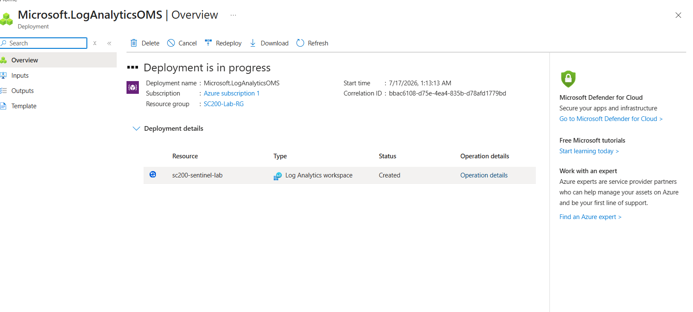
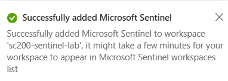
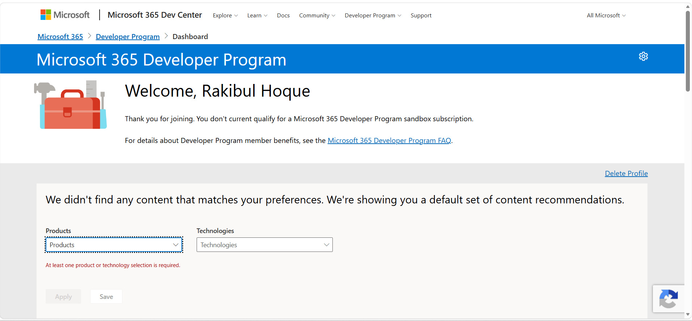
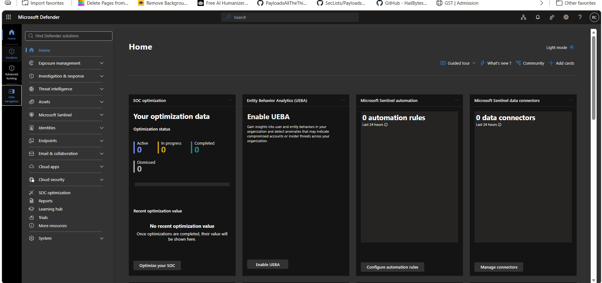
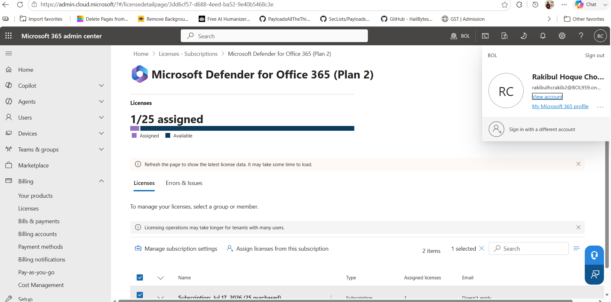
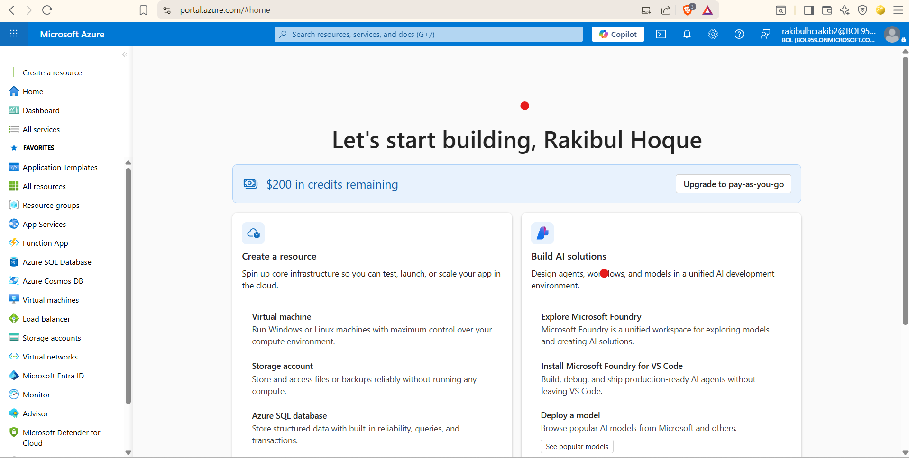
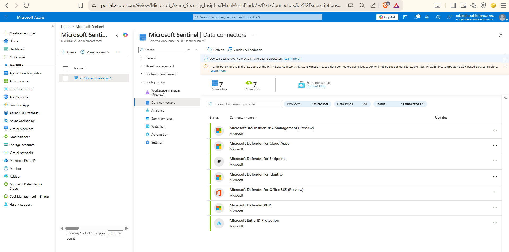
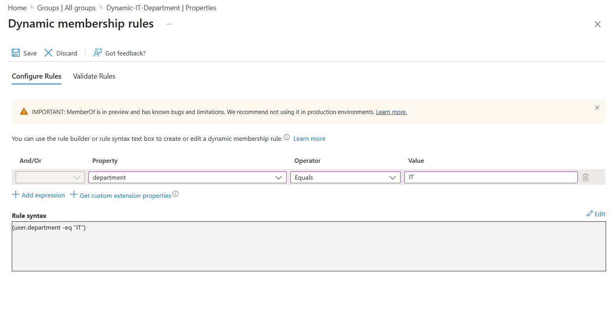

# Zero-to-SOC: A Self-Funded, Multi-Certification Cloud Security Lab

**Building a real, hands-on Microsoft 365 + Azure security and administration environment — end to end, on free-tier and trial subscriptions only — in preparation for Microsoft 365 Administration, SC-200 (Security Operations Analyst), and AZ-104 (Azure Administrator).**

  

---

## Table of contents

- [Why this exists](#why-this-exists)
- [The stack](#the-stack)
- [Project 1 — Environment Setup & Cross-Tenant Recovery](#project-1--environment-setup--cross-tenant-recovery)
- [Project 2 — Tenant, Users & Governance Foundation](#project-2--tenant-users--governance-foundation)
- [Key learnings across both projects](#key-learnings-across-both-projects)
- [Roadmap — upcoming projects](#roadmap--upcoming-projects)
- [About](#about)

---

## Why this exists

Certification guides teach concepts in a vacuum. They don't make you sit through a declined card, discover your SIEM is quietly pointed at the wrong tenant, or figure out why a group you just built has zero members. This repository documents, screenshot by screenshot, the actual process of building a functioning multi-cloud security lab from a completely empty account — mistakes, dead ends, and fixes included — rather than a cleaned-up "final state" walkthrough.

Every stage is called a **Project** rather than a "phase" or "module," because that's what it is: a self-contained unit of work with its own goal, its own problems, and its own resolution — the same way real infrastructure work is scoped.

---

## The stack

| Component | Role |
|---|---|
| Microsoft 365 Business Premium (trial) | Core tenant — mail, collaboration, base licensing |
| Microsoft Entra ID P2 (trial) | Identity governance — Conditional Access, Identity Protection, dynamic groups |
| Enterprise Mobility + Security E5 (trial) | Defender for Identity, Defender for Cloud Apps |
| Microsoft Defender for Office 365, Plan 2 (trial) | Email threat protection |
| Microsoft Sentinel (Azure) | SIEM/SOAR — detection engineering, KQL, incident response |
| Azure infrastructure ($200 free credit) | Resource Groups, RBAC, Storage, Networking, Compute |

---

## Project 1 — Environment Setup & Cross-Tenant Recovery

**Goal:** provision every license and service needed for the lab, on trial/free tiers only, with zero ongoing cost.

This project turned out to be less "click next a few times" and more "diagnose three separate problems in sequence" — which, in hindsight, was its own valuable exercise.

### 1.1 — Azure free account

Signed up via **"Try Azure for free"**, which provisioned $200 in credit and an automatic default directory (`rakibulhcrakib2gmail.onmicrosoft.com`).

### 1.2 — First Sentinel workspace

Created a Log Analytics workspace and enabled Microsoft Sentinel on it.

<table><tr>
<td></td>
<td></td>
</tr></table>

### 1.3 — Dead end: Microsoft 365 Developer Program

Attempted to get a card-free M365 E5 developer sandbox. The account was not eligible.

### 1.4 — Payment troubleshooting

Signing up for Microsoft 365 Business Premium, the domestic **debit card** used to verify Azure was repeatedly declined — even after multiple attempts. Root cause: the bank restricted international/recurring transactions on that card; a one-time Azure verification hold had gone through, but Business Premium's recurring-billing model triggered a security block.

**Resolution:** switched to a **dual-currency credit card**, which verified successfully on the first attempt. Every subsequent trial (Entra ID P2, EMS E5, Defender for Office 365 P2) was enrolled using this same card.

<table><tr>
<td></td>
<td></td>
</tr></table>

### 1.5 — Remaining trials

<table><tr>
<td></td>
<td></td>
<td></td>
</tr></table>

Verified all licenses were live by confirming full navigation access in the Microsoft Defender portal:

### 1.6 — The real problem: two different tenants

Reviewing the setup, it became clear the Sentinel workspace (Project 1.2) had been created under `rakibulhcrakib2gmail.onmicrosoft.com` — a **completely different tenant** from the one holding every M365/Defender license (`BOL959.onmicrosoft.com`). Azure and Microsoft 365 sign-in flows don't make the active tenant obvious, and two accounts with the same-looking username silently diverged into separate directories.

### 1.7 — Rebuilding in the correct tenant

Signed in to the Azure Portal using the `BOL959` tenant credentials directly — a second $200 credit was already active there, with no additional card verification required.

Created a fresh Log Analytics workspace and Sentinel instance inside this tenant:

### 1.8 — Verified: full integration

All 7 Defender XDR data connectors — Endpoint, Identity, Cloud Apps, Office 365, Entra ID Protection, Insider Risk Management, and the unified Defender XDR connector — reported **Connected**, correctly scoped to the licensed tenant.

### 1.9 — Known limitation

A standalone trial for **Defender for Endpoint Plan 2** could not be provisioned — checkout consistently offered only a paid option. This appears to be a Microsoft-side eligibility constraint rather than a configuration error. Endpoint protection fundamentals are covered in the interim by **Defender for Business**, bundled with Business Premium.

---

## Project 2 — Tenant, Users & Governance Foundation

**Goal:** populate the now-correctly-scoped tenant with test identities and governance structures, and stand up the equivalent Azure administrative foundation.

**📄 Full detail (26 screenshots, every sub-step documented): [`docs/PROJECT_2_DETAILED.md`](./docs/PROJECT_2_DETAILED.md)**

Summary of what was built:

- **User provisioning** — 5 test identities with deliberately varied license state, department, and job title (used as test data throughout later projects)
- **Security Group** (assigned membership) — `IT-Support-Team`
- **Microsoft 365 Group** — `Managing-Team`, verified it auto-provisioned a linked Team and SharePoint site
- **Dynamic Group** — a real debugging story: the M365 admin center's group wizard only supports Assigned membership; dynamic rules had to be configured separately in the Entra admin center (`(user.department -eq "IT")`), and membership evaluation turned out to be asynchronous rather than instant
- **Azure governance foundation** — explored the Management Group → Subscription hierarchy, then created a tagged Resource Group (`environment: lab`, `owner: rakibul`) as the scoping unit for every later Azure project

*The one screenshot that matters most from this project — the M365 admin center simply doesn't expose this screen.*

---

## Key learnings across both projects

1. **Payment failures can be bank-side, not account-side.** A domestic debit card that verifies a one-time Azure hold can still be blocked on a recurring-billing merchant. A dual-currency credit card resolved it reliably.
2. **Always confirm which tenant is active before provisioning.** Azure and Microsoft 365 sessions can silently diverge into different directories even when the sign-in usernames look identical — this cost an entire rebuild.
3. **The simplified admin UI is not the full picture.** The Microsoft 365 admin center covers common tasks well, but advanced identity governance (dynamic groups, PIM, administrative units) lives in the Entra admin center.
4. **Background processes aren't instant.** Dynamic group membership, license propagation, and connector activation can all take several minutes — don't assume a misconfiguration too early.
5. **Tag at creation, not after.** Applying `environment`/`owner` tags when a Resource Group is created (rather than retrofitting later) keeps cost tracking clean once Storage and Compute projects begin.

---

## Roadmap — upcoming projects

| # | Project | Certification focus |
|---|---|---|
| 1 | Environment Setup & Cross-Tenant Recovery | ✅ Complete |
| 2 | Tenant, Users & Governance Foundation | ✅ Complete |
| 3 | Identity Security — MFA, Conditional Access, Identity Protection | M365 / SC-200 |
| 4 | RBAC & Delegated Administration (M365 + Azure) | M365 / AZ-104 |
| 5 | Azure Storage | AZ-104 |
| 6 | Azure Networking | AZ-104 |
| 7 | Azure Compute (+ on-prem-style AD DS for Defender for Identity) | AZ-104 / SC-200 |
| 8 | Email Security — Exchange + Defender for Office 365 | M365 / SC-200 |
| 9 | Endpoint Security — Intune + Defender for Endpoint | M365 / SC-200 |
| 10 | Collaboration & Cloud App Security | M365 / SC-200 |
| 11 | Data Protection & Compliance | M365 |
| 12 | Monitoring — Azure Monitor + Sentinel | AZ-104 / SC-200 |
| 13 | KQL (Kusto Query Language) | SC-200 |
| 14 | Detection Engineering — Analytics Rules | SC-200 |
| 15 | Incident Investigation | SC-200 |
| 16 | Automation, Backup & Cost Management | AZ-104 / SC-200 |

Full task-level detail for every upcoming project: [`ROADMAP_DETAIL.md`](./ROADMAP_DETAIL.md)

---

## About

Maintained by **Rakibul Hoque Chowdhury**, pursuing CEH → OSCP → OSDA alongside this project.
