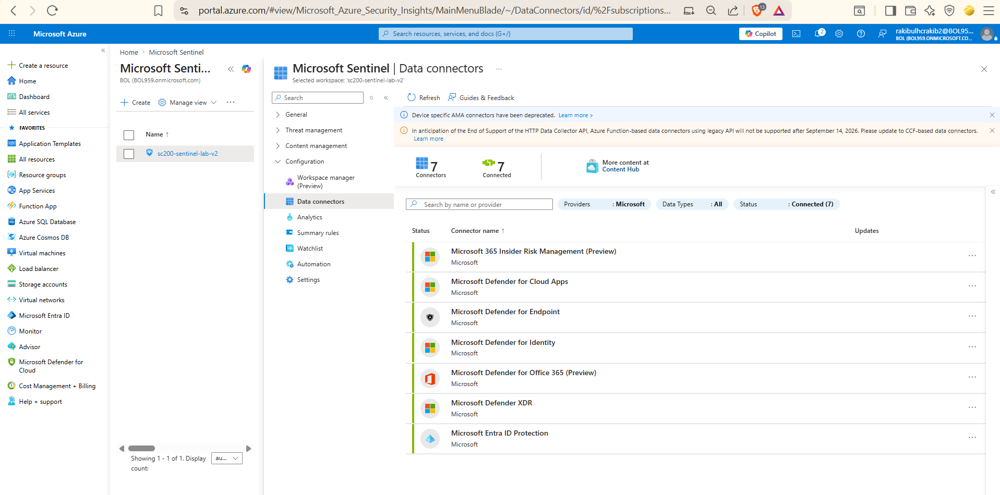
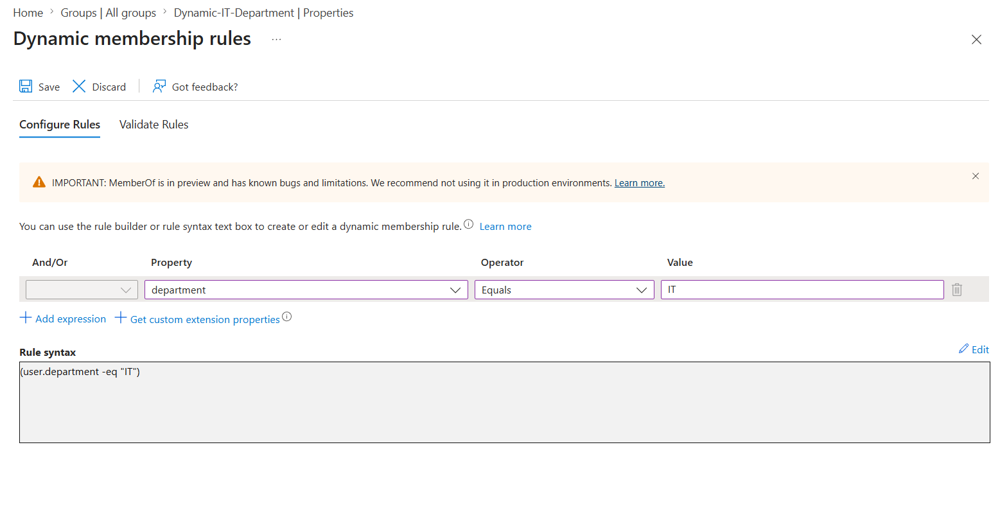
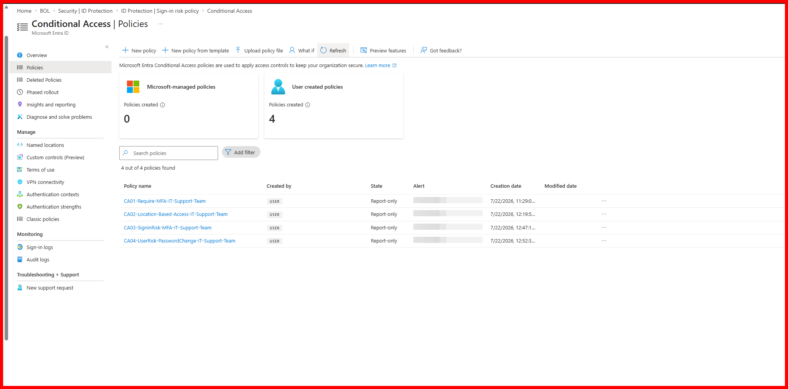

# Zero-to-SOC: A Self-Funded, Multi-Certification Cloud Security Lab

**Building a real, hands-on Microsoft 365 + Azure security and administration environment — end to end, on free-tier and trial subscriptions only — in preparation for Microsoft 365 Administration, SC-200 (Security Operations Analyst), and AZ-104 (Azure Administrator).**

  

---

## Table of contents

- [Why this exists](#why-this-exists)
- [The stack](#the-stack)
- [Project 1 — Environment Setup & Cross-Tenant Recovery](#project-1--environment-setup--cross-tenant-recovery)
- [Project 2 — Tenant, Users & Governance Foundation](#project-2--tenant-users--governance-foundation)
- [Project 3 — Identity Security: MFA, Conditional Access & Identity Protection](#project-3--identity-security-mfa-conditional-access--identity-protection)
- [Project 4 — RBAC & Delegated Administration (M365 + Azure)](#project-4--rbac--delegated-administration-m365--azure)
- [Project 5 — Azure Storage](#project-5--azure-storage-az-104)
- [Project 6 — Azure Networking: VNet, NSG, Peering & Bastion](#project-6--azure-networking-vnet-nsg-peering--bastion-az-104)
- [Key learnings across all six projects](#key-learnings-across-all-six-projects)
- [Roadmap — upcoming projects](#roadmap--upcoming-projects)
- [About](#about)

---

## Why this exists

Certification guides teach concepts in a vacuum. They don't make you sit through a declined card, discover your SIEM is quietly pointed at the wrong tenant, or figure out why a group you just built has zero members. This repository documents, screenshot by screenshot, the actual process of building a functioning multi-cloud security lab from a completely empty account — mistakes, dead ends, and fixes included — rather than a cleaned-up "final state" walkthrough.

Every stage is called a **Project** rather than a "phase" or "module," because that's what it is: a self-contained unit of work with its own goal, its own problems, and its own resolution — the same way real infrastructure work is scoped.

---

## The stack

| Component | Role |
|---|---|
| Microsoft 365 Business Premium (trial) | Core tenant — mail, collaboration, base licensing |
| Microsoft Entra ID P2 (trial) | Identity governance — Conditional Access, Identity Protection, dynamic groups, PIM |
| Enterprise Mobility + Security E5 (trial) | Defender for Identity, Defender for Cloud Apps |
| Microsoft Defender for Office 365, Plan 2 (trial) | Email threat protection |
| Microsoft Sentinel (Azure) | SIEM/SOAR — detection engineering, KQL, incident response |
| Azure infrastructure ($200 free credit) | Resource Groups, RBAC, Storage, Networking, Compute |

---

## Project 1 — Environment Setup & Cross-Tenant Recovery

**Goal:** provision every license and service needed for the lab, on trial/free tiers only, with zero ongoing cost.

**📄 Full detail (16 screenshots, every sub-step documented): [`project-1-environment-setup/README.md`](./project-1-environment-setup/README.md)**

This project turned out to be less "click next a few times" and more "diagnose three separate problems in sequence":

- **Provisioned** Azure ($200 credit) and an M365 tenant, then every trial license needed (Business Premium, Entra ID P2, EMS E5, Defender for Office 365 P2)
- **Payment troubleshooting** — a debit card that verified Azure fine was repeatedly declined on Business Premium's recurring-billing model; a dual-currency credit card resolved it on the first attempt
- **Dead end** — the Microsoft 365 Developer Program rejected the account for a card-free sandbox
- **The real problem** — discovered the first Sentinel workspace had been built in a completely different tenant than the one holding every license, since Azure and M365 sign-ins don't make the active tenant obvious
- **Recovery** — rebuilt Sentinel from scratch in the correct tenant and verified all 7 Defender XDR connectors reporting Connected

*The moment that confirmed the rebuild worked — same tenant, fully integrated.*

---

## Project 2 — Tenant, Users & Governance Foundation

**Goal:** populate the now-correctly-scoped tenant with test identities and governance structures, and stand up the equivalent Azure administrative foundation.

**📄 Full detail (26 screenshots, every sub-step documented): [`project-2-governance-foundation/README.md`](./project-2-governance-foundation/README.md)**

Summary of what was built:

- **User provisioning** — 5 test identities with deliberately varied license state, department, and job title (used as test data throughout later projects)
- **Security Group** (assigned membership) — `IT-Support-Team`
- **Microsoft 365 Group** — `Managing-Team`, verified it auto-provisioned a linked Team and SharePoint site
- **Dynamic Group** — a real debugging story: the M365 admin center's group wizard only supports Assigned membership; dynamic rules had to be configured separately in the Entra admin center (`(user.department -eq "IT")`), and membership evaluation turned out to be asynchronous rather than instant
- **Azure governance foundation** — explored the Management Group → Subscription hierarchy, then created a tagged Resource Group (`environment: lab`, `owner: rakibul`) as the scoping unit for every later Azure project

*The one screenshot that matters most from this project — the M365 admin center simply doesn't expose this screen.*

---

## Project 3 — Identity Security: MFA, Conditional Access & Identity Protection

**Goal:** move beyond password-only sign-in by layering per-user MFA, group-scoped Conditional Access, location-based access, and risk-based policies on top of the Project 1–2 tenant — then verify with logs that the policies actually fire.

**📄 Full detail (31 screenshots, every sub-step documented): [`project-3-identity-security/README.md`](./project-3-identity-security/README.md)**

Summary of what was built:

- **Per-user MFA** enabled for test user `Shakhawat Hossian Anik`, as a baseline before moving to Conditional Access
- **CA01** — required MFA for the existing `IT-Support-Team` group (reused rather than duplicated) across all cloud apps
- **CA02** — location-based access: a `Bangladesh-Trusted` named location, MFA required everywhere except it
- **CA03 / CA04** — sign-in risk and user risk policies, rebuilt as Conditional Access after discovering the classic Identity Protection risk policy pages are being retired October 1, 2026
- **Verification** — 5 deliberate failed logins, confirmed end-to-end via Sign-in logs (error `50126`) and the Conditional Access Policy Impact tab, all policies kept in **Report-only** throughout

*CA01 through CA04, all evaluated in Report-only mode before anything gets enforced.*

---

## Project 4 — RBAC & Delegated Administration (M365 + Azure)

**Goal:** move from "everyone is Global Admin / Owner" to scoped, least-privilege access — per-role M365 admin delegation, PIM just-in-time activation, Azure RBAC (built-in and custom), and a hard guardrail (Resource Lock) that survives even Owner-level access.

**📄 Full detail (22 screenshots, every sub-step documented): [`project-4-rbac-delegated-administration/README.md`](./project-4-rbac-iam/README.md)**

Summary of what was built:

- **M365 User Administrator role** — assigned and verified: could reset passwords and create users, blocked from granting Global Admin
- **Administrative Unit** — a scoped admin whose Active Users list only showed in-scope members; accounts outside the AU didn't just become un-editable, they weren't in the list at all
- **PIM eligible role** — Exchange Administrator set to Eligible (not Active); confirmed the account was blocked before activation, then got full Exchange admin center access the moment it self-activated
- **Azure RBAC — Reader** — could view a resource group, blocked from creating any resource in it
- **Custom RBAC role** ("VM Operator") — built from just 3 Actions (start/restart/stop); the assigned user hit a 401 even opening the resource group blade, since narrowly-scoped custom roles don't inherit the generic `resourceGroups/read` permission that Reader carries as a wildcard
- **Resource Lock** — a Delete lock that blocked deletion even when attempted from the tenant's own Global Administrator / Owner account

*Locks sit above RBAC entirely — no role assignment, however privileged, overrides one.*

---

## Project 5 — Azure Storage (AZ-104)

**Goal:** move from access-control theory into a mechanic AZ-104 tests directly — Blob storage and tiering, a real mountable Azure File Share, scoped time-boxed access via SAS tokens, an automated cost-lifecycle policy, and soft delete recovery — each one tested end-to-end rather than just configured and screenshotted.

**📄 Full detail (38 screenshots, every sub-step documented): [`project-5-storage-management/README.md`](./project-5-storage-management/README.md)**

Summary of what was built:

- **Storage account + Blob container** — `strakibullab01`, container `mycontainer`, a test file uploaded and downloaded; caught the account defaulting to Geo-redundant storage (GRS) and switched to Locally-redundant (LRS) before creation
- **Access tier change** — moved a blob from Hot to Cool, verified via the ACCESS TIER LAST MODIFIED timestamp that the change actually committed rather than just appearing to
- **Azure File Share** — `myfileshare` mounted as a real Windows network drive; the creation wizard tried to silently enable Azure Backup by default (unchecked before creating), and the mount itself succeeded in an Administrator PowerShell session but didn't appear in File Explorer until re-run in a normal session — a genuine admin-vs-user drive-mapping gap
- **SAS token** — generated a read-only, HTTPS-only, time-boxed Shared Access Signature and tested the URL live in a private browser tab with zero Azure login
- **Lifecycle management policy** — a single rule automating the full cost lifecycle: 30 days → Cool, 90 days → Archive, 365 days → Delete
- **Soft delete** — deleted a blob on purpose, confirmed it disappeared from the container's default "active blobs" view, then recovered it via Undelete with identical hash, tier, and size intact

*Read-only, time-boxed, zero credentials exchanged — the SAS token doing exactly what it's supposed to.*

---

## Project 6 — Azure Networking: VNet, NSG, Peering & Bastion (AZ-104)

**Goal:** build the core network layer for the lab — a segmented VNet, a security-group-filtered subnet, a public IP, peered connectivity between two VNets, and Azure Bastion for remote access that never requires a VM to carry its own public IP. AWS VPC was dropped from this phase entirely; the lab stays Azure/Microsoft-only going forward.

**📄 Full detail (90 screenshots, every sub-step documented): [`project-6-networking-full/README.md`](./project-6-networking-full/README.md)**

Summary of what was built:

- **VNet + 2 subnets** — `vnet-lab-sc200` (`10.10.0.0/16`) split into `subnet-app` (`10.10.1.0/24`) and `subnet-data` (`10.10.2.0/24`)
- **NSG with inbound/outbound rules** — `nsg-app-subnet`, with SSH (22) restricted to a single source IP rather than the open internet, an explicit outbound HTTPS (443) rule, and the NSG associated directly to `subnet-app`
- **Public IP** — a standalone Standard-SKU static IP, provisioned for later use
- **VNet Peering** — a second VNet (`vnet-lab-sc200-peer`, non-overlapping `10.20.0.0/16`) peered with the first, verified **from both sides** (each VNet shows its own peering link name and "Connected" status independently)
- **Azure Bastion** — reviewed the configuration first, then actually deployed it, spun up a no-public-IP test VM, and connected to it live through the browser — confirmed with a real shell prompt, not just a green checkmark — before deleting everything to stop the hourly billing

Along the way: a home ISP that rotated its public IP mid-session and broke the just-configured NSG rule, three VM sizes rejected as unavailable before one finally deployed, and a resource-group Delete lock (left over from Project 4) that silently blocked the cleanup until it was found, lifted, and restored afterward.

*azureuser@vm-test-linux:~$ — proof the connection works without the VM ever being exposed to the internet.*

---

## Key learnings across all six projects

1. **Payment failures can be bank-side, not account-side.** A domestic debit card that verifies a one-time Azure hold can still be blocked on a recurring-billing merchant. A dual-currency credit card resolved it reliably.
2. **Always confirm which tenant is active before provisioning.** Azure and Microsoft 365 sessions can silently diverge into different directories even when the sign-in usernames look identical — this cost an entire rebuild.
3. **The simplified admin UI is not the full picture.** The Microsoft 365 admin center covers common tasks well, but advanced identity governance (dynamic groups, PIM, administrative units) lives in the Entra admin center.
4. **Background processes aren't instant.** Dynamic group membership, license propagation, and connector activation can all take several minutes — don't assume a misconfiguration too early.
5. **Tag at creation, not after.** Applying `environment`/`owner` tags when a Resource Group is created (rather than retrofitting later) keeps cost tracking clean once Storage and Compute projects begin.
6. **Report-only is the safe default for new Conditional Access policies.** It confirms a policy is evaluated correctly against real sign-in activity before it can lock anyone out.
7. **Microsoft's own tooling is mid-migration.** Classic Identity Protection risk policies are being sunset in favor of Conditional Access — worth knowing since the live portal won't always match older certification material.
8. **Scoping restricts visibility, not just actions.** Both the Administrative Unit and the custom RBAC role showed accounts/resources disappearing from view entirely, rather than throwing an access-denied error.
9. **Eligible ≠ Active, and it's easy to get one when you meant the other.** This tenant's Entra ID P2 license extends PIM governance to Azure resource roles by default — two separate role assignments in Project 4 landed as Eligible when Active was intended.
10. **A Resource Lock is the strongest guardrail in the whole RBAC toolkit** — strong enough that it later blocked its owner's own cleanup work in Project 6 until it was deliberately lifted.
11. **Portal wizards default to the option that costs more or does more than asked.** Geo-redundant storage over Locally-redundant, and an auto-enabled backup vault during file share creation, both surfaced in Project 5 alone — worth a second look on every Create screen, not just these two.
12. **A soft-deleted resource often isn't visible in the default UI view**, which can look identical to a permanent delete if the filter itself isn't known. Visibility settings deserve as much attention as the safety feature underneath them.
13. **A subnet-level NSG rule protects any resource later placed in that subnet** — no separate NSG was needed at the VM level once `subnet-app` already had one attached.
14. **Inbound and outbound NSG rules are not symmetric by default.** Azure's built-in rules end in an implicit Deny All for inbound traffic, but already allow outbound internet access — inbound needs explicit rules far more urgently than outbound does.
15. **VM size availability is subscription- and region-specific, not universal.** Three different low-cost sizes were rejected as unavailable in Project 6 before one finally deployed — worth checking availability before planning around a specific SKU.
16. **Deleting a resource doesn't always delete what it created.** Azure Bastion's auto-generated public IP survives Bastion's own deletion and has to be cleaned up as a separate step.

---

## Roadmap — upcoming projects

| # | Project | Certification focus |
|---|---|---|
| 1 | Environment Setup & Cross-Tenant Recovery | ✅ Complete |
| 2 | Tenant, Users & Governance Foundation | ✅ Complete |
| 3 | Identity Security — MFA, Conditional Access, Identity Protection | ✅ Complete |
| 4 | RBAC & Delegated Administration (M365 + Azure) | ✅ Complete |
| 5 | Azure Storage | ✅ Complete |
| 6 | Azure Networking — VNet, NSG, Peering, Bastion | ✅ Complete |
| 7 | Azure Compute (+ on-prem-style AD DS for Defender for Identity) | AZ-104 / SC-200 |
| 8 | Email Security — Exchange + Defender for Office 365 | M365 / SC-200 |
| 9 | Endpoint Security — Intune + Defender for Endpoint | M365 / SC-200 |
| 10 | Collaboration & Cloud App Security | M365 / SC-200 |
| 11 | Data Protection & Compliance | M365 |
| 12 | Monitoring — Azure Monitor + Sentinel | AZ-104 / SC-200 |
| 13 | KQL (Kusto Query Language) | SC-200 |
| 14 | Detection Engineering — Analytics Rules | SC-200 |
| 15 | Incident Investigation | SC-200 |
| 16 | Automation, Backup & Cost Management | AZ-104 / SC-200 |

Full task-level detail for every upcoming project: [`ROADMAP.md`](./ROADMAP.md)

---

## About

Maintained by **Rakibul Hoque Chowdhury**, pursuing CEH → OSCP → OSDA alongside this project.
