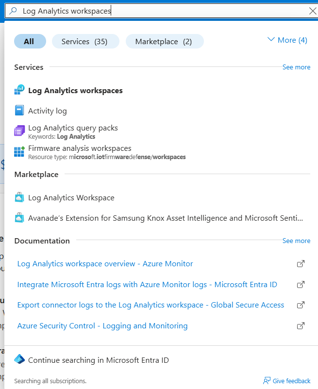
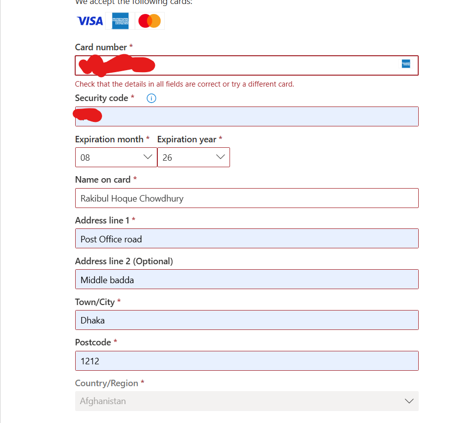
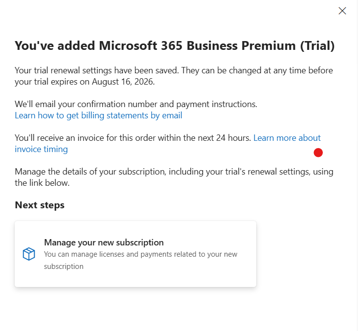
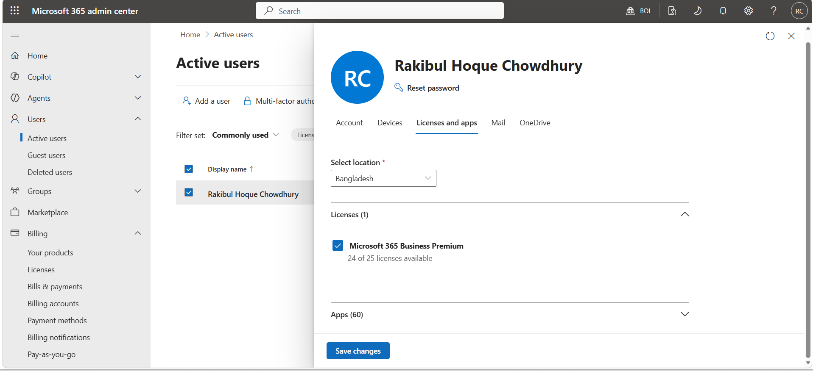
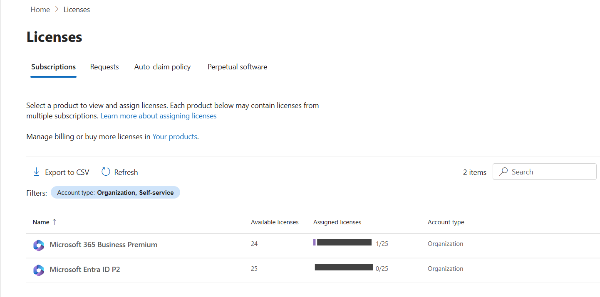
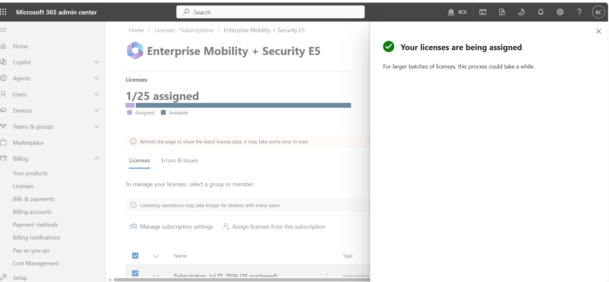
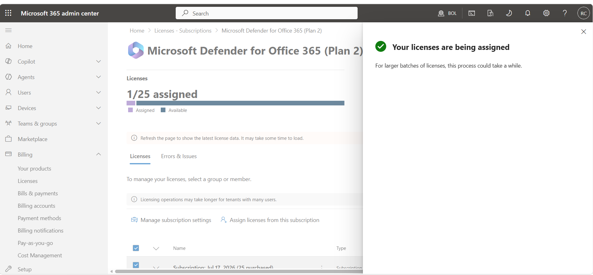
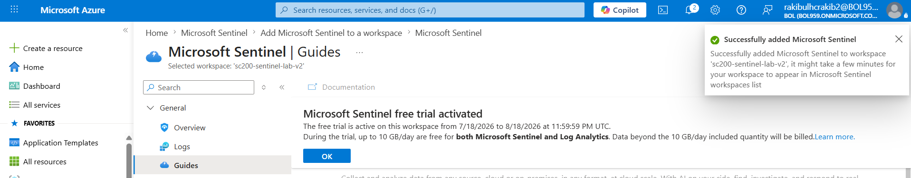
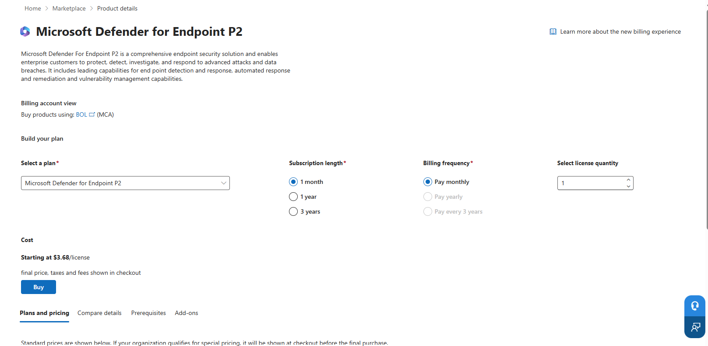

# Project 1 — Environment Setup & Cross-Tenant Recovery

**Part of: [Zero-to-SOC](../README.md) — a self-funded, multi-certification cloud security lab**

This document is the full, unabridged record of Project 1 — every sub-step, in order, with the screenshot that proves it happened.

**Environment goal:** provision Microsoft 365 Business Premium, Entra ID P2, Enterprise Mobility + Security E5, Defender for Office 365 P2, and Microsoft Sentinel — trial/free tiers only, zero ongoing cost.

---

## Project 1 — Environment Setup & Cross-Tenant Recovery

**Goal:** provision every license and service needed for the lab, on trial/free tiers only, with zero ongoing cost.

This project turned out to be less "click next a few times" and more "diagnose three separate problems in sequence" — which, in hindsight, was its own valuable exercise.

### 1.1 — Azure free account

Signed up via **"Try Azure for free"**, which provisioned $200 in credit and an automatic default directory (`rakibulhcrakib2gmail.onmicrosoft.com`).

### 1.2 — First Sentinel workspace

Created a Log Analytics workspace and enabled Microsoft Sentinel on it.

<table><tr>
<td></td>
<td></td>
</tr></table>

### 1.3 — Dead end: Microsoft 365 Developer Program

Attempted to get a card-free M365 E5 developer sandbox. The account was not eligible.

### 1.4 — Payment troubleshooting

Signing up for Microsoft 365 Business Premium, the domestic **debit card** used to verify Azure was repeatedly declined — even after multiple attempts. Root cause: the bank restricted international/recurring transactions on that card; a one-time Azure verification hold had gone through, but Business Premium's recurring-billing model triggered a security block.

**Resolution:** switched to a **dual-currency credit card**, which verified successfully on the first attempt. Every subsequent trial (Entra ID P2, EMS E5, Defender for Office 365 P2) was enrolled using this same card.

<table><tr>
<td></td>
<td></td>
</tr></table>

### 1.5 — Remaining trials

<table><tr>
<td></td>
<td></td>
<td></td>
</tr></table>

Verified all licenses were live by confirming full navigation access in the Microsoft Defender portal:

### 1.6 — The real problem: two different tenants

Reviewing the setup, it became clear the Sentinel workspace (Project 1.2) had been created under `rakibulhcrakib2gmail.onmicrosoft.com` — a **completely different tenant** from the one holding every M365/Defender license (`BOL959.onmicrosoft.com`). Azure and Microsoft 365 sign-in flows don't make the active tenant obvious, and two accounts with the same-looking username silently diverged into separate directories.

### 1.7 — Rebuilding in the correct tenant

Signed in to the Azure Portal using the `BOL959` tenant credentials directly — a second $200 credit was already active there, with no additional card verification required.

Created a fresh Log Analytics workspace and Sentinel instance inside this tenant:

### 1.8 — Verified: full integration

All 7 Defender XDR data connectors — Endpoint, Identity, Cloud Apps, Office 365, Entra ID Protection, Insider Risk Management, and the unified Defender XDR connector — reported **Connected**, correctly scoped to the licensed tenant.

### 1.9 — Known limitation

A standalone trial for **Defender for Endpoint Plan 2** could not be provisioned — checkout consistently offered only a paid option. This appears to be a Microsoft-side eligibility constraint rather than a configuration error. Endpoint protection fundamentals are covered in the interim by **Defender for Business**, bundled with Business Premium.

---

## Summary of what this proves

| Area | What happened | What was learned |
|---|---|---|
| Payments | Debit card declined on a recurring-billing merchant despite verifying Azure fine | A decline can be bank-side (international/recurring transaction restrictions), not account-side — a dual-currency credit card resolved it instantly |
| Free trials | Microsoft 365 Developer Program rejected the account | Not every free path is available to every account; a documented workaround (paid-trial route) kept the project moving |
| Tenancy | Sentinel workspace and M365 licenses ended up in two different tenants | Azure and M365 sign-ins don't make the active tenant obvious — always confirm the directory shown in the portal before provisioning |
| Recovery | Rebuilt Sentinel from scratch in the correct tenant | A clean rebuild was faster and safer than trying to migrate/fix the misconfigured workspace |
| Known limitation | Defender for Endpoint P2 standalone trial never became available | Documenting an unresolved gap honestly is more useful than hiding it — Defender for Business covers the fundamentals in the meantime |

**Next:** [Project 2 — Tenant, Users & Governance Foundation](../project-2-governance-foundation/README.md)
