# Project 11 — Compliance (Microsoft Purview)

**Part of the [Zero-to-SOC](https://github.com/rakibulhcrafat07/Microsoft-365-Azure-Sentinel-SC200-Lab) self-funded cloud security lab — targeting Microsoft 365 Administration, SC-200, and AZ-104 certifications.**

Tenant: `BOL959.onmicrosoft.com` | Portal: `purview.microsoft.com` | Licensing: Free-tier Microsoft 365 + trial licenses

---

## Concept

Earlier projects controlled **who can get in** (identity, Conditional Access) and **what they can do** (RBAC). Project 11 asks a different question: **what is the data itself doing?**

Three separate capabilities inside Microsoft Purview answer that:

| Capability | Question it answers |
|---|---|
| **Retention** | How long does data stay, and when does it get deleted or archived? |
| **DLP (Data Loss Prevention)** | Is sensitive data (credit card numbers, national IDs, etc.) leaving the organization or landing in the wrong place? |
| **Audit** | Can we prove, after the fact, who did what and when? |

**SC-200 relevance:** a SOC analyst doesn't just detect attacks — after an incident, they need to prove what data was exposed and reconstruct a timeline, which is exactly what Purview Audit is for.

---

## Task 1 — Explore Microsoft Purview compliance portal

Logged into `purview.microsoft.com` and reviewed the landing page. Left navigation exposes the three solutions used in this project: **Solutions** (Data Lifecycle Management, Data Loss Prevention), **Settings**, and **Audit**.

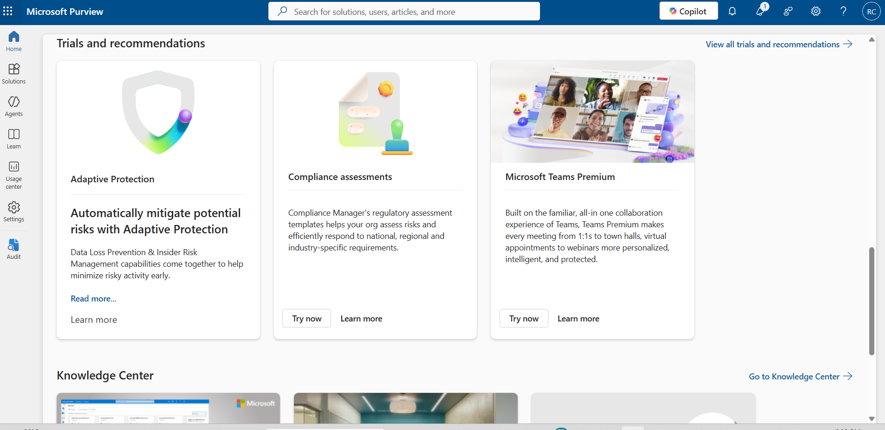

---

## Task 2 — Retention Policy

**Goal:** retain SharePoint content for 3 years, then auto-delete.

- Navigated to **Data Lifecycle Management → Policies → Retention policies**
- **Finding:** the **Adaptive** policy type is greyed out — it requires a Microsoft 365 E5 license, which this free-tier tenant doesn't have. Used **Static** scope instead (manually chosen locations).
- Created policy `RP-SharePoint-Retain3Yr`:
  - Locations: **SharePoint sites** only (Exchange mailboxes and OneDrive accounts explicitly turned off to keep scope focused)
  - Retention: **3 years** from creation date, then **delete items automatically**
- Purview flagged an important warning before submit: items already older than 3 years in the selected locations would be **permanently deleted** the moment the policy activates. Not a risk in this lab (fresh tenant, no old data), but a critical real-world caution.
- Policy created successfully. Purview noted enforcement can take **up to a week** to propagate.

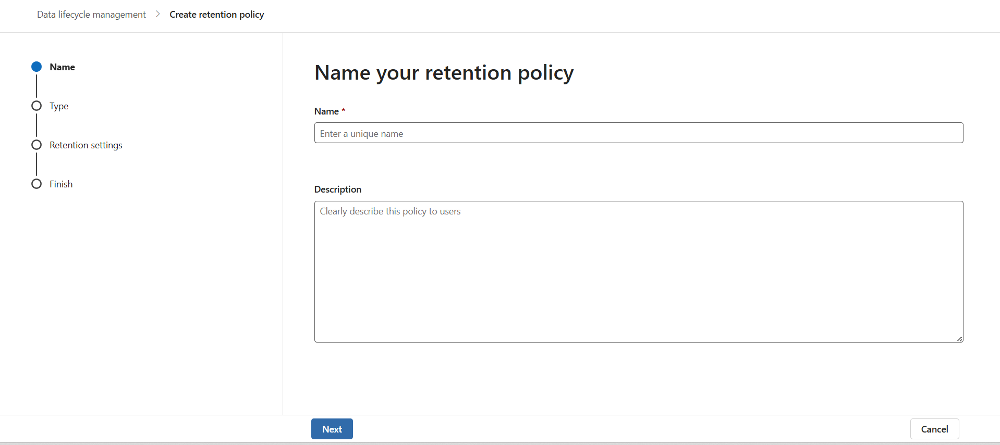
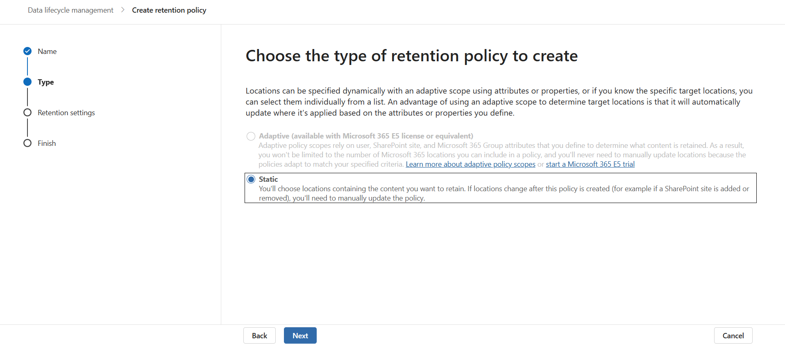
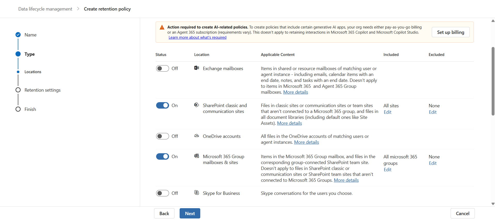
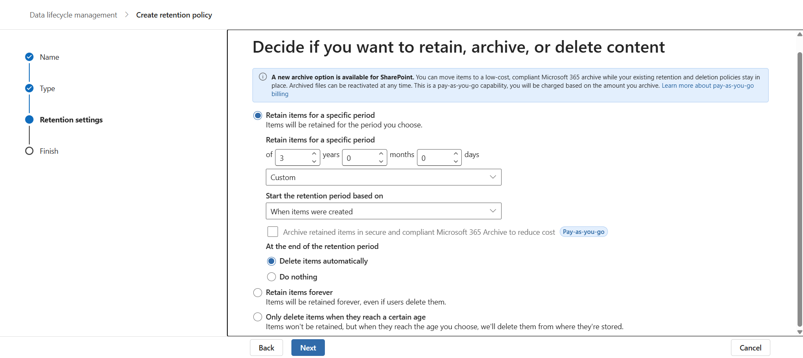
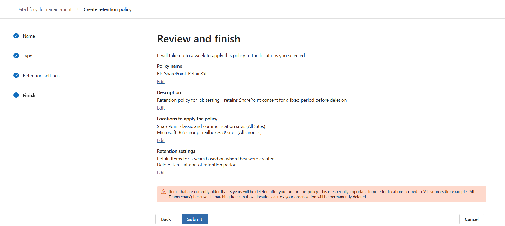
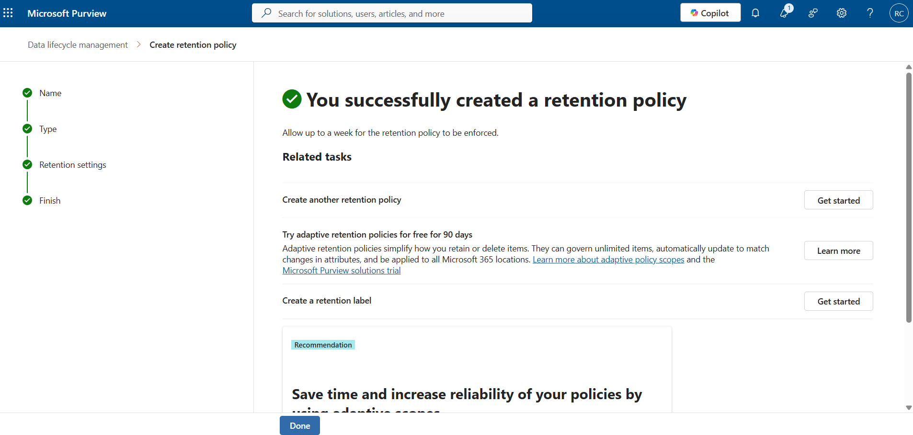

---

## Task 3 — DLP (Data Loss Prevention) Policy

**Goal:** detect credit card numbers being shared via SharePoint/OneDrive, in a non-destructive way (Report-only pattern, consistent with this lab's principle of never enforcing blocking actions by default).

- Category: **Financial → PCI Data Security Standard (PCI DSS)** — a built-in template that detects **Credit Card Number**
- Locations: scoped to **SharePoint sites** and **OneDrive accounts** only (Exchange, Teams, Instances, on-premises repositories turned off)
- **Finding:** Admin Units configuration is also gated behind an E5 license (same limitation as Task 2's Adaptive scope) — left at default (Full directory)
- Match threshold lowered from the default **10 instances** down to **1**, so a single test file would trigger detection
- Protection actions: policy tips + email notification, incident reports, and DLP-match alerts all enabled. **"Restrict access or encrypt the content" left unchecked** — this is the key decision that keeps the policy non-destructive
- Policy mode: **Simulation mode** (Report-only equivalent for DLP) — the policy evaluates content and generates alerts but never blocks anything
- Policy created: `PCI Data Security Standard (PCI DSS)`

**Live test:**
- Created a test file (`DLP-Test-CreditCard.txt`) containing the Visa test card number `4111 1111 1111 1111` (not a real card — this is the industry-standard test number used for payment system testing)
- Uploaded it to the `ExternalShare-Test` SharePoint site (the same site built in Project 10)
- Used Purview's built-in **sensitive info type Test tool** (Classifiers → Sensitive info types → Credit Card Number → Test) to upload the same file directly — confirmed the detection engine itself works correctly, matching the card number at **Low, Medium, and High confidence**, all tied to the surrounding text "Card Number"
- **Finding:** despite the detection engine working correctly on direct file test, the same file sitting in SharePoint did **not** generate a DLP alert even after 20+ minutes. This points to SharePoint DLP relying on a backend content crawl cycle rather than scanning in real time — a known Microsoft behavior, more pronounced on trial/free-tier tenants where crawl frequency is not accelerated.

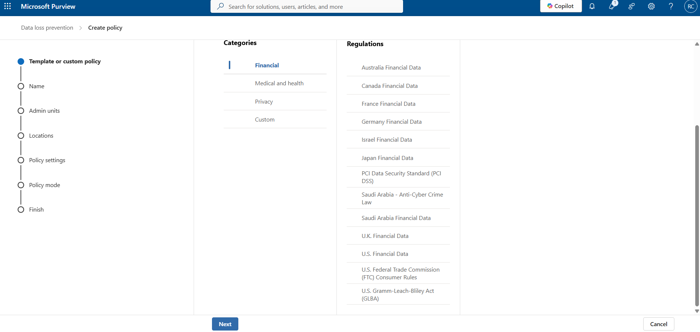
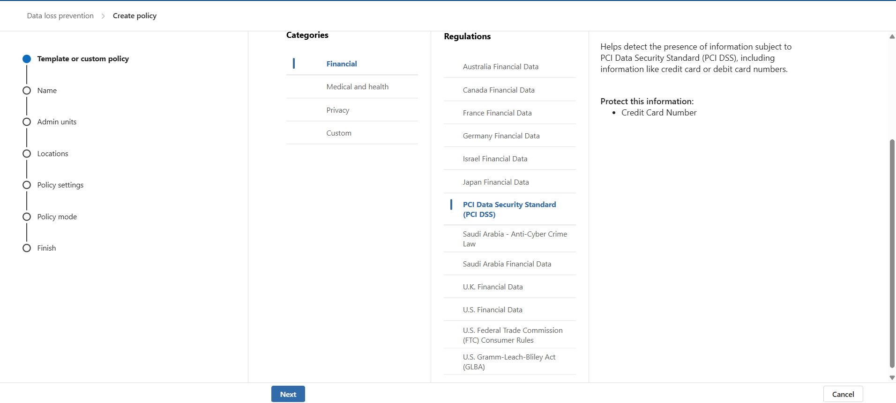
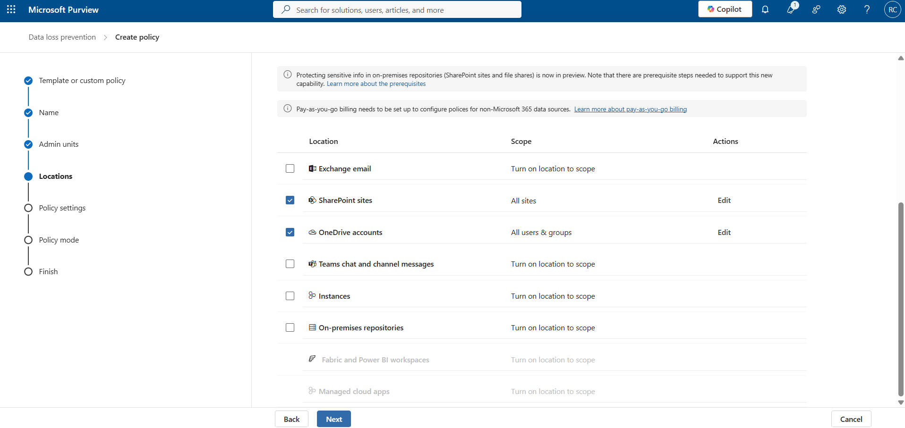
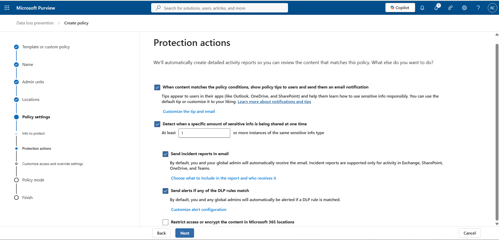
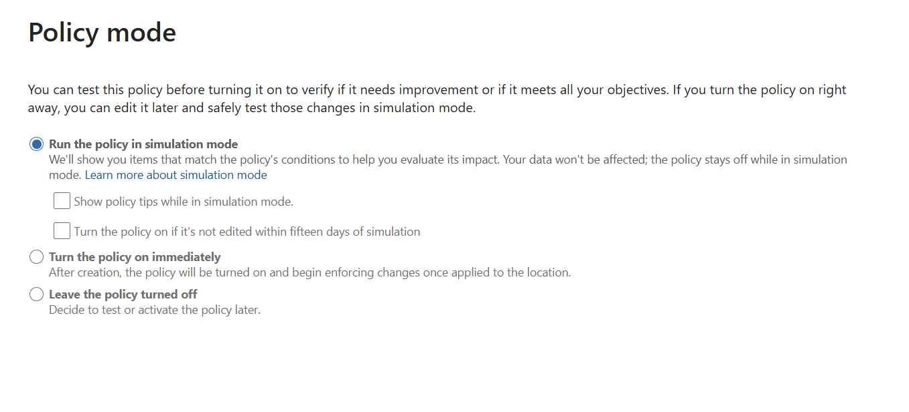
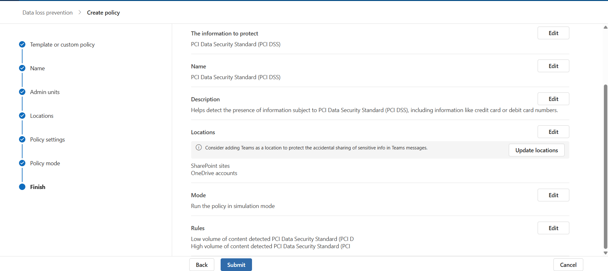
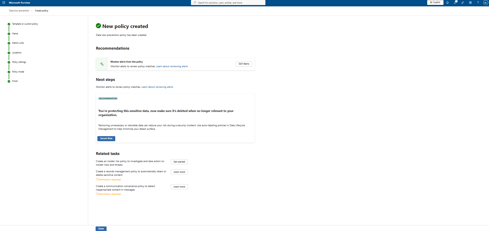
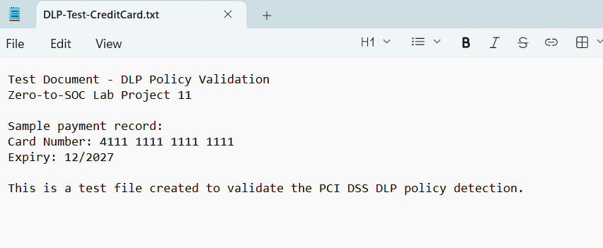
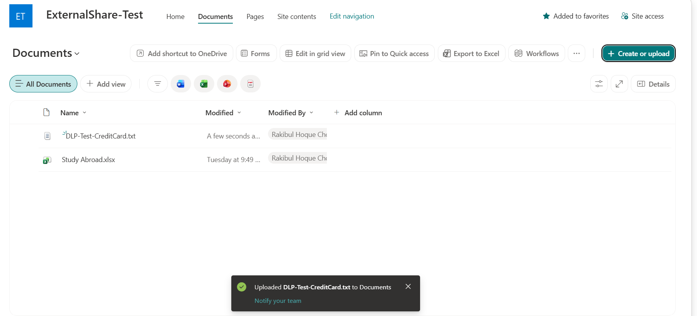
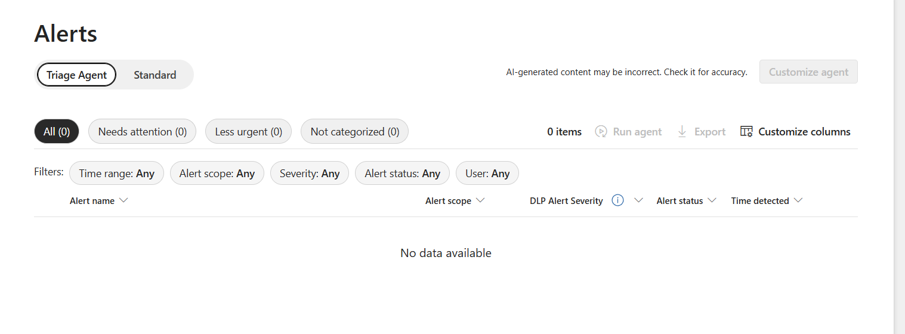
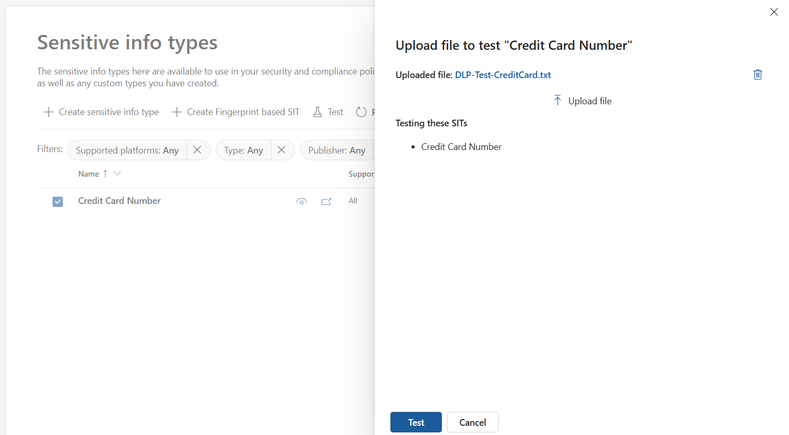
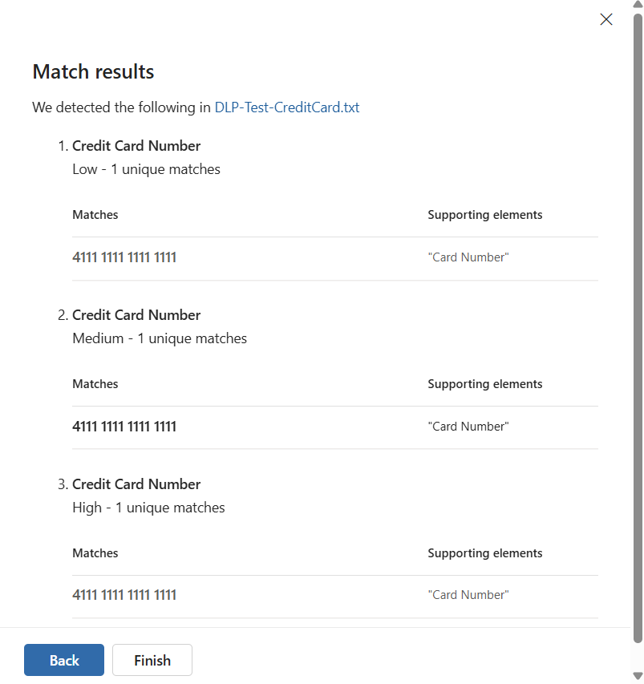

---

## Task 4 — Audit Log Search

**Goal:** verify that admin/compliance activity is captured in the Unified Audit Log.

- First search: keyword `retention`, date range covering the retention policy creation — **0 results**
- Broadened search with no keyword filter, same date range — returned **2 results**, but both were routine `ExchangeItemAggregated` / "Accessed mailbox" events, not the retention or DLP policy creation actions themselves
- **Finding:** compliance policy management activities (retention policy creation, DLP policy creation) were not visible in the audit log within the search window, despite the policies showing as successfully created and synced in their respective portals. This could be an ingestion delay or a different record-type classification than what was searched.
- Filtered by **Record Type = ComplianceDLPSharePoint** — returned 0 items, which is the *expected* result since no actual DLP rule match had occurred yet (record type only populates on real matches, not policy creation)

**Overall Task 4 conclusion:** the audit search mechanism itself works correctly (proven by the 2 mailbox-access results and the correctly-scoped ComplianceDLPSharePoint filter), but specific compliance-policy-management events were not captured within the observed window — documented as a finding rather than hidden.

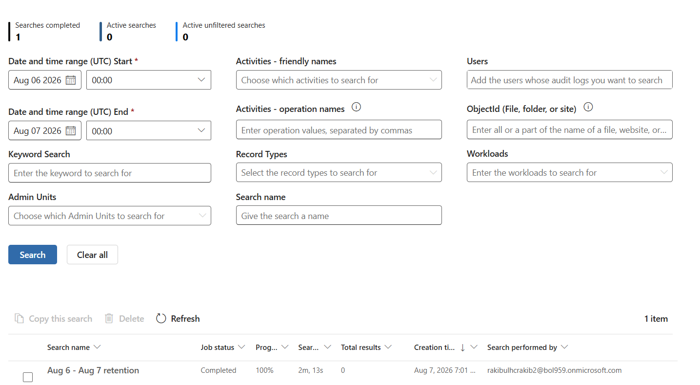
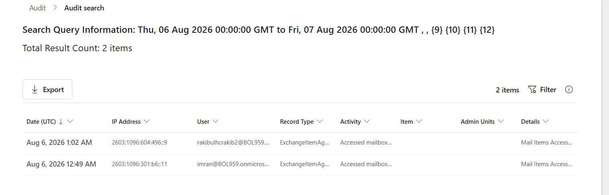
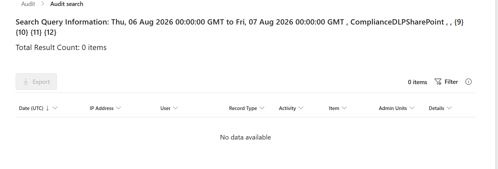

---

## Mistakes & Fixes

| # | Issue | Root Cause | Fix / Resolution |
|---|---|---|---|
| 1 | Adaptive retention policy scope greyed out | Requires Microsoft 365 E5 license, not present on this free-tier tenant | Used Static scope instead, manually selecting SharePoint as the location |
| 2 | Admin Units step disabled during DLP policy creation | Same E5 licensing gate as adaptive scopes | Left at default (Full directory) — acceptable for lab scope |
| 3 | Retention policy locations accidentally included Microsoft 365 Group mailboxes & sites | Auto-enabled by the wizard alongside SharePoint | Left as-is since it only extends coverage to group-connected SharePoint content, not a functional problem |
| 4 | DLP policy mode showed "Test without notifications" in the policy list, despite checking "Show policy tips" during setup | Possible UI/save discrepancy in the wizard — unconfirmed | Documented as-is; did not block the lab exercise since alerts/incident reports were still enabled |
| 5 | Audit search jobs took 1–3+ minutes to move from "Queued"/"In progress" to "Completed" | Purview audit search runs asynchronously in the backend | Waited and refreshed manually; no fix needed, just a timing characteristic to plan around |
| 6 | Keyword search "retention" in Audit returned 0 results even though the policy was confirmed created | Policy-management admin actions may not be indexed under simple keyword search, or ingestion lag | Switched to a broad search (no keyword) plus Record Type filtering to narrow down instead |
| 7 | DLP policy did not generate an alert for a test file uploaded to SharePoint, even after 20+ minutes | SharePoint DLP scanning depends on a backend content crawl cycle, not real-time inspection — confirmed the detection *engine* itself worked correctly via the standalone Sensitive Info Type Test tool | Documented as a genuine platform limitation on trial tenants; not something fixable from the admin side within the lab timeframe |

---

## Key Learnings

- Retention and DLP policies in Microsoft Purview are two independent mechanisms: retention controls the *lifespan* of content, DLP controls what happens when sensitive *content patterns* are detected — they don't overlap functionally even though they live in the same portal.
- Several Purview capabilities (Adaptive retention scopes, Admin Units) are silently gated behind Microsoft 365 E5 licensing and appear only as greyed-out options with no error — worth checking license requirements before assuming a feature is broken.
- Static/manual location scoping is a reasonable substitute for Adaptive scoping in smaller or license-constrained tenants, at the cost of needing manual updates if locations change later.
- Report-only philosophy applies directly to DLP: leaving "Restrict access or encrypt the content" unchecked and running the policy in Simulation mode keeps detection fully non-destructive, matching this lab's established non-destructive-by-default approach.
- The built-in Sensitive Info Type **Test** tool (Classifiers → Sensitive info types → Test) is the fastest way to validate whether a detection pattern works, completely independent of whether a DLP policy or location scanning pipeline is functioning — useful for isolating "is my pattern wrong" from "is my pipeline slow."
- DLP detection timing differs significantly by workload: Exchange (mail flow) evaluates at send-time, while SharePoint/OneDrive rely on a backend content crawl that can take well beyond 20 minutes on a trial tenant — plan test timelines accordingly.
- Microsoft Purview Audit search is asynchronous and can take 1–3+ minutes per query; keyword search is not guaranteed to surface every type of admin activity, and broad search + Record Type filtering is a more reliable diagnostic approach.
- Not finding an expected audit trail is itself a valid, documentable lab finding — real environments have ingestion delays and coverage gaps that are worth knowing about before relying on audit logs during an actual incident response.

---

## Deliverables

- GitHub-ready folder: `project-11-compliance/` (this README + `images/`)
- LinkedIn-style PDF write-up
- LinkedIn and Facebook captions
