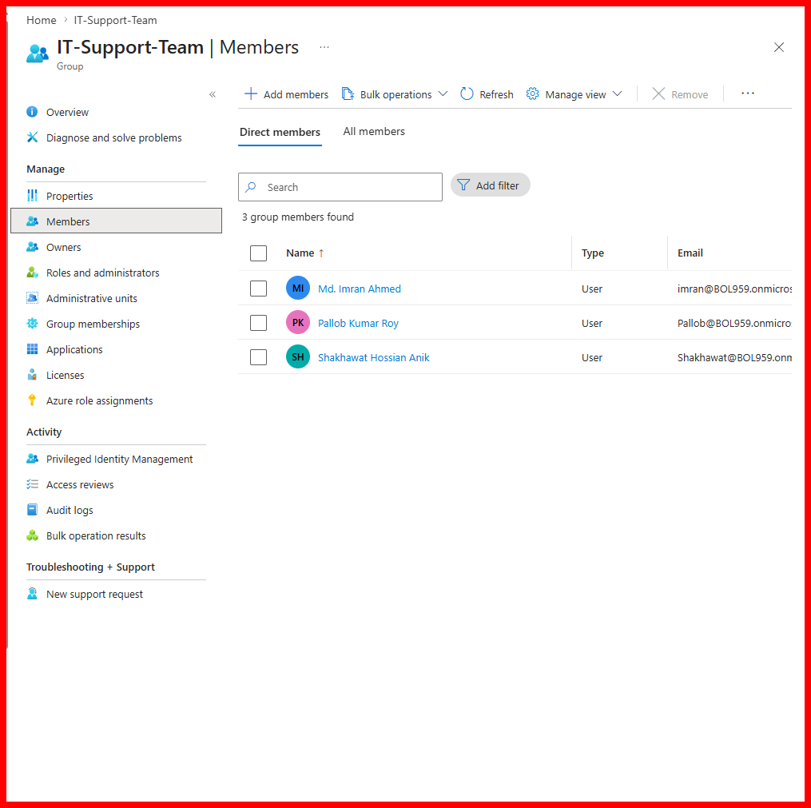
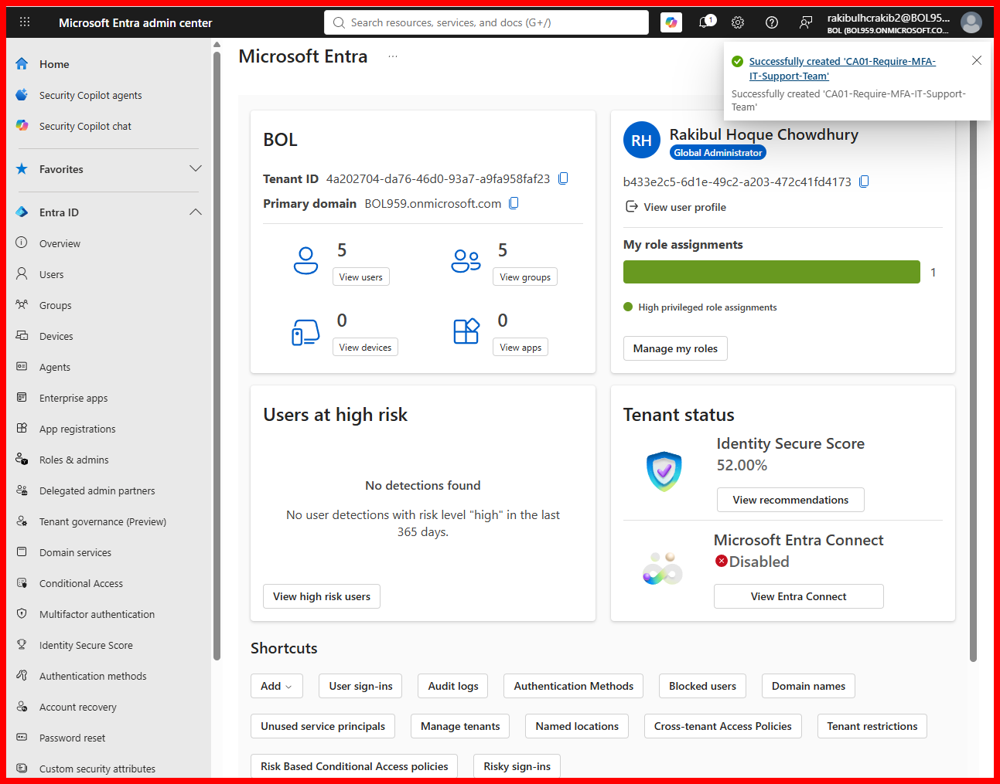
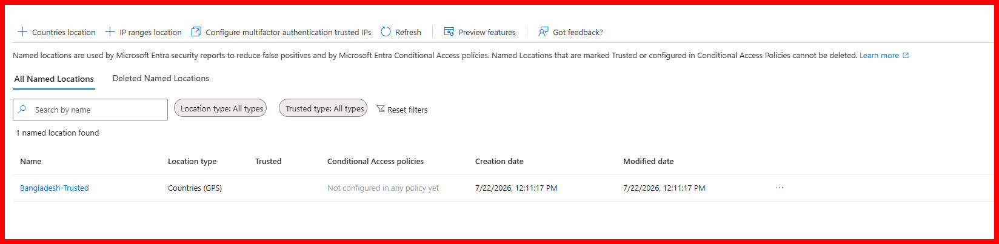
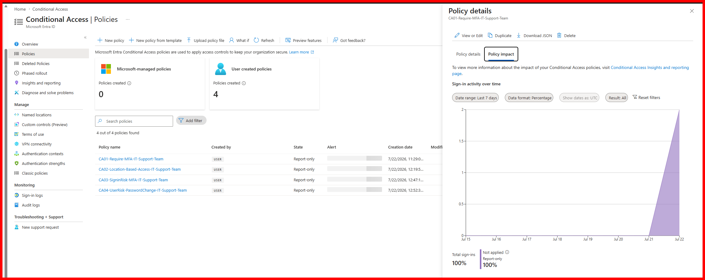

# Project 3 — Identity Security: MFA, Conditional Access & Identity Protection

[#project-3--identity-security-mfa-conditional-access--identity-protection](#project-3--identity-security-mfa-conditional-access--identity-protection)

**Goal:** move beyond password-only authentication by layering per-user MFA, group-scoped Conditional Access policies, location-based access control, and risk-based policies (sign-in risk / user risk) on top of the tenant built in Projects 1–2 — then verify, with logs, that the policies actually fire.

**📄 Certification focus:** M365 Administration / SC-200

---

## Table of contents

[#table-of-contents](#table-of-contents)

- [Why this project](#why-this-project)
- [What was built](#what-was-built)
- [Step 1 — Per-user MFA](#step-1--per-user-mfa)
- [Step 2 — Conditional Access: group-based MFA](#step-2--conditional-access-group-based-mfa)
- [Step 3 — Named location & location-based Conditional Access](#step-3--named-location--location-based-conditional-access)
- [Step 4 — Sign-in risk & user risk policies](#step-4--sign-in-risk--user-risk-policies)
- [Step 5 — Verification: deliberate failed logins](#step-5--verification-deliberate-failed-logins)
- [Mistakes, dead ends, and fixes](#mistakes-dead-ends-and-fixes)
- [Key learnings](#key-learnings)
- [What's next](#whats-next)

---

## Why this project

[#why-this-project](#why-this-project)

A password alone isn't verification — it's guessable, phishable, and leaks. The core idea behind this project is Zero Trust: **never trust, always verify.** Instead of relying on a single static secret, identity is verified through multiple signals — something you know (password), something you have (MFA), where you're connecting from (location), and how risky the sign-in itself looks (Identity Protection).

This project builds that stack directly on top of the tenant and test users provisioned in [Project 2](../project-2-governance-foundation/README.md), rather than creating new scaffolding — reusing what already exists where it made sense.

---

## What was built

[#what-was-built](#what-was-built)

| Component | Detail |
|---|---|
| Per-user MFA | Enabled for test user `Shakhawat Hossian Anik` |
| Security group reused | `IT-Support-Team` (existing, assigned membership) — used as the CA policy target instead of creating a new group |
| CA01 | `CA01-Require-MFA-IT-Support-Team` — require MFA for the group, all cloud apps |
| Named location | `Bangladesh-Trusted` (Countries/GPS-based) |
| CA02 | `CA02-Location-Based-Access-IT-Support-Team` — require MFA for any location *except* Bangladesh |
| CA03 | `CA03-SigninRisk-MFA-IT-Support-Team` — require MFA on Low/Medium/High sign-in risk |
| CA04 | `CA04-UserRisk-PasswordChange-IT-Support-Team` — require MFA + password change on High user risk |
| Verification | 5 deliberate failed logins as `Shakhawat`, confirmed via Sign-in logs and Conditional Access Policy Impact |

All four Conditional Access policies were created and kept in **Report-only** mode — evaluated and logged, but not enforced — which is the safe way to validate a policy before switching it on.

---

## Step 1 — Per-user MFA

[#step-1--per-user-mfa](#step-1--per-user-mfa)

Enabled per-user MFA for `Shakhawat Hossian Anik` (`Shakhawat@BOL959.onmicrosoft.com`) via **Entra admin center → Users → Per-user MFA**.

*Status flips from `disabled` to `enabled` for the selected test user.*

> **Note:** Per-user MFA is Microsoft's legacy enforcement method. It was used here only to confirm the basic registration mechanic — the actual enforcement in this project happens through Conditional Access (Step 2 onward), which is the current recommended approach.

---

## Step 2 — Conditional Access: group-based MFA

[#step-2--conditional-access-group-based-mfa](#step-2--conditional-access-group-based-mfa)

Rather than creating a new security group, the existing `IT-Support-Team` group (Security type, Assigned membership, created in Project 2) was reused as the CA policy target — `Shakhawat` was added as a third member.

*3 group members found — Md. Imran Ahmed, Pallob Kumar Roy, Shakhawat Hossian Anik.*

**Policy: `CA01-Require-MFA-IT-Support-Team`**
- Users/groups: `IT-Support-Team`
- Target resources: All resources (formerly All cloud apps)
- Grant: Require multifactor authentication
- State: **Report-only**

---

## Step 3 — Named location & location-based Conditional Access

[#step-3--named-location--location-based-conditional-access](#step-3--named-location--location-based-conditional-access)

Created a Countries-based named location, `Bangladesh-Trusted`, then built a second policy that requires MFA for sign-ins from **anywhere except** that trusted location.

**Policy: `CA02-Location-Based-Access-IT-Support-Team`**
- Network: **Include** → Any network or location · **Exclude** → `Bangladesh-Trusted`
- Grant: Require multifactor authentication
- State: **Report-only**

---

## Step 4 — Sign-in risk & user risk policies

[#step-4--sign-in-risk--user-risk-policies](#step-4--sign-in-risk--user-risk-policies)

The classic Identity Protection **Sign-in risk policy** and **User risk policy** pages turned out to be in the process of being retired (see [Mistakes, dead ends, and fixes](#mistakes-dead-ends-and-fixes)), so both were rebuilt as Conditional Access policies instead — which is the direction Microsoft is actively pushing customers toward.

**Policy: `CA03-SigninRisk-MFA-IT-Support-Team`**
- Condition: Sign-in risk → Low, Medium, High
- Grant: Require multifactor authentication

**Policy: `CA04-UserRisk-PasswordChange-IT-Support-Team`**
- Condition: User risk → High
- Grant: Require multifactor authentication **and** Require password change

Sign-in risk was set to trigger on Low and above because the resulting action (an MFA challenge) is low-friction. User risk was restricted to High only, because its action (forced password change) is disruptive and should only fire on strong-confidence signals like leaked credentials.

---

## Step 5 — Verification: deliberate failed logins

[#step-5--verification-deliberate-failed-logins](#step-5--verification-deliberate-failed-logins)

To confirm the policies were actually being evaluated (not just sitting inert), `Shakhawat`'s account was used to deliberately fail sign-in 5 times with an incorrect password.

**Sign-in logs** confirmed all 5 attempts, each with error code `50126` (invalid username or password), from Gulshan, Dhaka, BD:

**Conditional Access → Policy impact** on `CA01` confirmed the policy was matched against these sign-ins (visible as a spike in sign-in activity) while remaining in Report-only — evaluated, logged, not enforced:

This closes the loop: user → group → policy → log, end to end.

---

## Mistakes, dead ends, and fixes

[#mistakes-dead-ends-and-fixes](#mistakes-dead-ends-and-fixes)

1. **Classic risk policies are being retired.** Opening the legacy Identity Protection **Sign-in risk policy** page surfaced a banner stating the policy is now read-only and will be retired on **October 1, 2026** — Microsoft wants risk-based policies migrated to Conditional Access. Rebuilt both risk policies (CA03, CA04) as Conditional Access policies instead of using the legacy pages.
2. **"All agent resources" vs. "All resources."** While building CA04, Target resources defaulted to *All agent resources* instead of *All resources (formerly 'All cloud apps')*. Entra blocked policy creation with: *`"All cloud apps" must be selected when "Require password change" grant is selected`*. Fixed by explicitly selecting "All resources."
3. **Location Include/Exclude direction.** The first attempt at CA02 selected `Bangladesh-Trusted` under **Include**, which would have applied the policy *only* to sign-ins from Bangladesh — the opposite of the intent. Corrected by switching Bangladesh to **Exclude** with Include set to "Any network or location," so the policy applies to everywhere *except* the trusted country.
4. **"Create" succeeded despite a security-defaults warning.** A banner appeared during CA01 creation warning that Security Defaults may need to be disabled before enabling a Conditional Access policy. Policy creation succeeded regardless (kept in Report-only), so no action was needed at this stage — worth revisiting before switching any policy to enforced/On.

---

## Key learnings

[#key-learnings](#key-learnings)

1. **Report-only is the safe default for new CA policies.** It lets you confirm a policy is being evaluated correctly against real sign-in activity (via Policy impact) before it can lock anyone out.
2. **Reuse existing groups where the fit is genuine.** `IT-Support-Team` was already an Assigned-membership Security group — creating a second, near-duplicate group would have added noise without adding learning value.
3. **Grant control combinations have hard requirements.** "Require password change" specifically requires "All resources" as the target — a good example of how grant controls and target resources aren't fully independent settings.
4. **The direction of Include/Exclude matters as much as the condition itself.** The same named location can produce the opposite security outcome depending on which side of Include/Exclude it's placed.
5. **Microsoft's own tooling is mid-migration.** Classic Identity Protection risk policies are actively being sunset in favor of Conditional Access — a useful thing to know for SC-200, since exam content and the live portal won't always match.

---

## What's next

[#whats-next](#whats-next)

Full roadmap: [`ROADMAP.md`](../ROADMAP.md)

Next up: **Project 4 — RBAC & Delegated Administration (M365 + Azure)**.
