# Project 4 — RBAC & Delegated Administration (M365 + Azure)

**Goal:** move from "everyone is Global Admin / Owner" to scoped, least-privilege access — per-role M365 admin delegation, PIM just-in-time activation, Azure RBAC (built-in and custom), and a hard guardrail (Resource Lock) that survives even Owner-level access.

**Certification focus:** M365 Administration / AZ-104 / SC-200

---

## Why this is a long post

Most "I set up RBAC" write-ups show one role assignment and a green checkmark. This one shows the assignment silently landing as **Eligible** instead of **Active** twice in a row (Entra ID P2 extends PIM governance further than expected), a scoped admin whose user list *shrank* rather than throwing an error, a custom role that could operate on VMs but couldn't even open the resource group blade, and a resource lock that stopped a delete initiated by the tenant's own Global Administrator.

---

## What was built

| # | Item | Result |
| --- | --- | --- |
| 1 | M365 — User Administrator role | Assigned to a test user, verified: can reset passwords + create users, blocked from granting Global Admin |
| 2 | M365 — Administrative Unit | Scoped admin created for `IT-Support-AU`; verified the scoped admin's user list only shows in-scope members |
| 3 | M365 — PIM eligible role | Exchange Administrator set as Eligible (not Active); verified pre-activation lockout and self-service activation |
| 4 | AZ-104 — Azure RBAC Reader | Reader assigned on a resource group; verified read access + blocked resource creation |
| 5 | AZ-104 — Custom RBAC role | Built "VM Operator" (start/restart/stop only); verified action-level scoping and its blind spot |
| 6 | AZ-104 — Resource Lock | Delete lock on a resource group; verified it blocks deletion even for the Owner/Global Admin account |

---

## 4.1 — M365: User Administrator role

Entra admin center → Roles & administrators → **User Administrator** → Add assignments. Assigned to `Wardha Anjum` (not the admin account, so a misconfiguration here can't lock out the person configuring it) as an **Active** assignment.

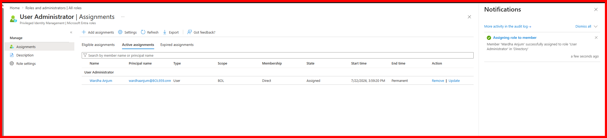

Logged in as Wardha in a separate session — successfully signed into the M365 admin center.

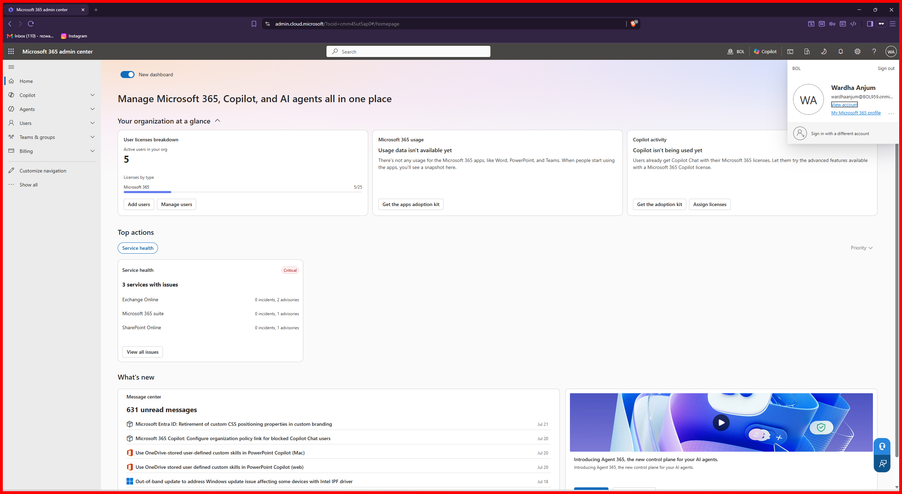

**Verified — could do:** reset another user's password,

and create a brand-new user with full license assignment.

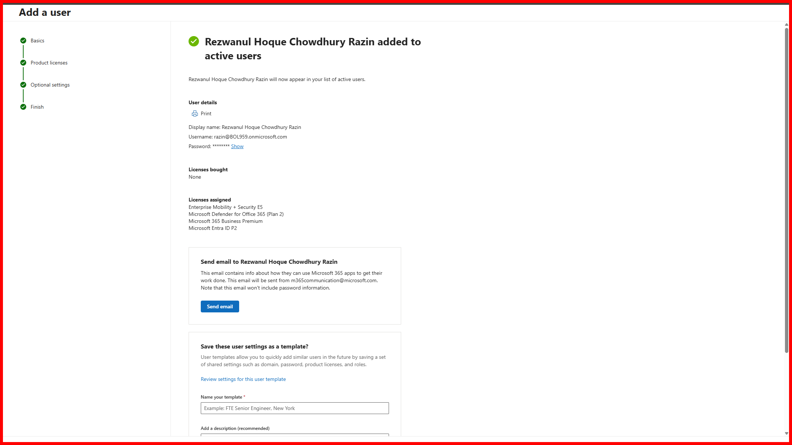

**Verified — could NOT do:** self-elevate to Global Administrator.

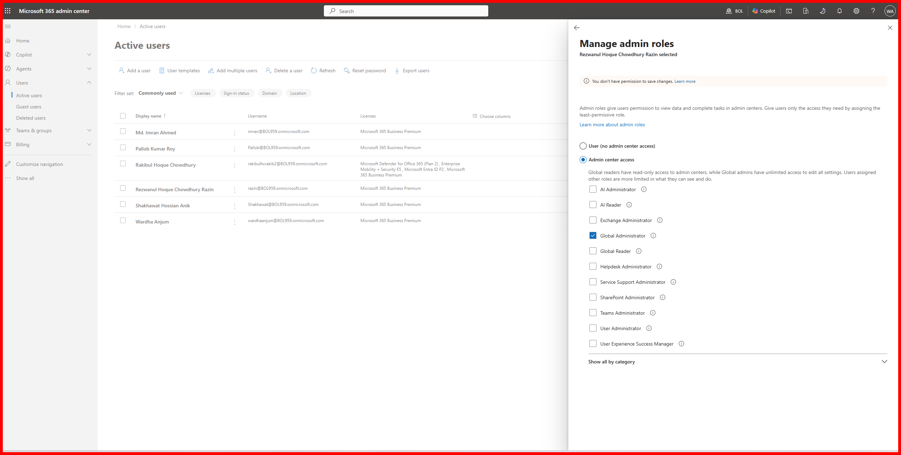

> Textbook least privilege: full control over users and passwords, zero path to tenant-wide admin.

---

## 4.2 — M365: Administrative Unit (scoped admin)

Created `IT-Support-AU`, assigned `Shakhawat Hossian Anik` as User Administrator scoped to just this AU, then added two users as AU members.

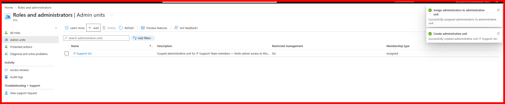

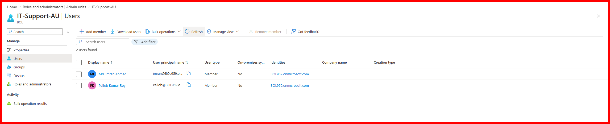

> ⚠️ **Unexpected finding:** logged in as Shakhawat, the Active Users list itself only showed the 2 AU members — users outside the AU didn't appear in the list at all. Scoping isn't just an action restriction, it restricts *visibility* at the list level. Password reset succeeded for the in-scope user; there was nothing outside the AU to even attempt against.

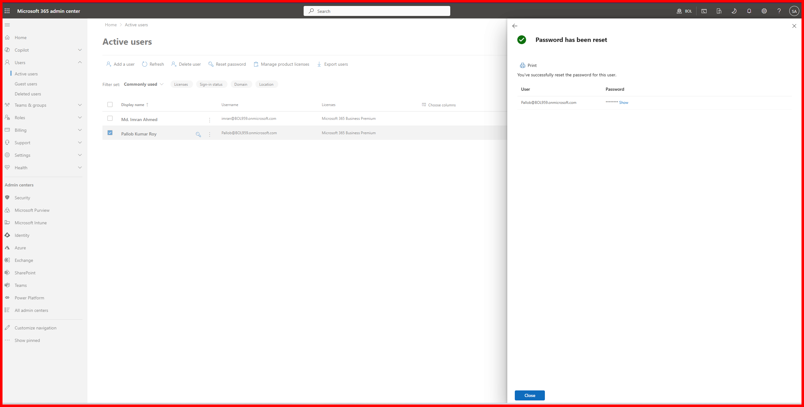

---

## 4.3 — M365: PIM eligible role assignment

Assigned Exchange Administrator to a test user as **Eligible** (Permanently eligible), not Active — the point being that having the role assigned shouldn't mean having the power right away.

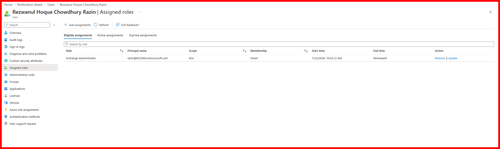

**Before activation:** the same user tried to open the M365 admin center and was blocked outright — eligible ≠ active.

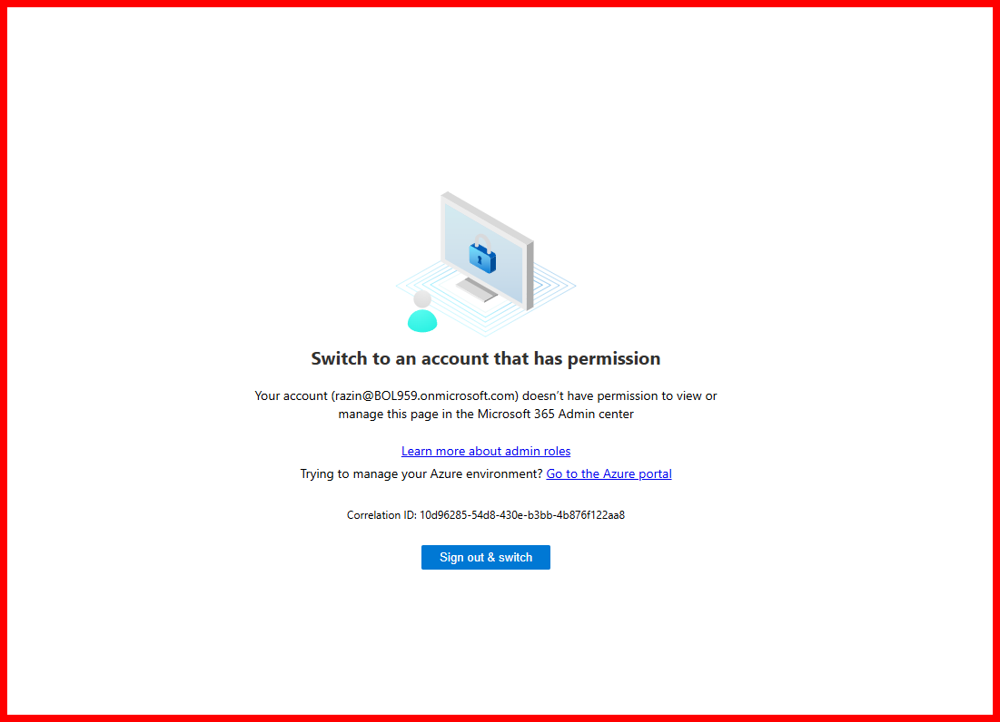
> ⚠️ **Navigation note:** the self-service "Activate" button isn't under My Access/entitlement management — it's Entra ID → **Privileged Identity Management → My roles → Microsoft Entra roles**. Took several wrong turns to find it.

Self-activated with a 0.5-hour duration and a justification. All 3 stages passed.

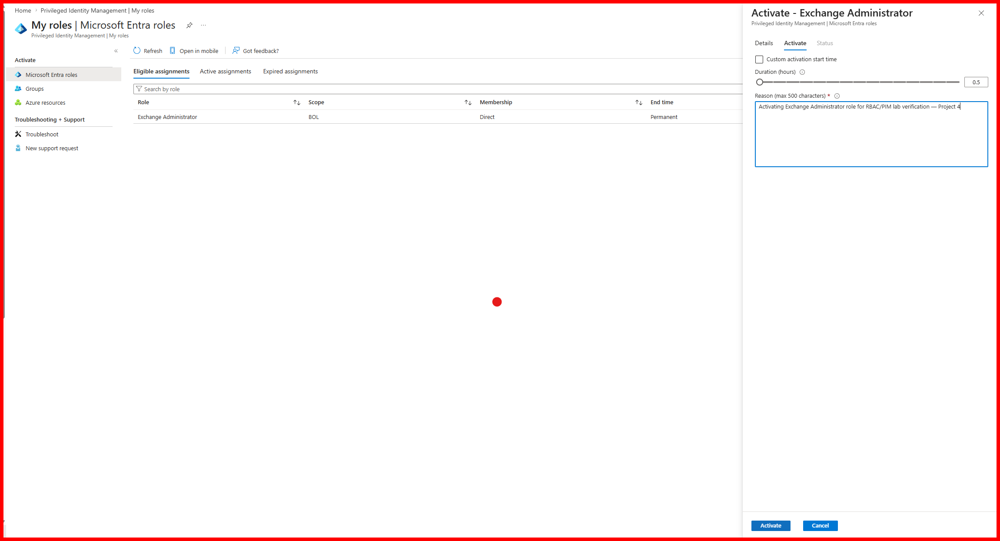

Confirmed in the Active assignments tab — State: Activated, time-bound end time (not Permanent).

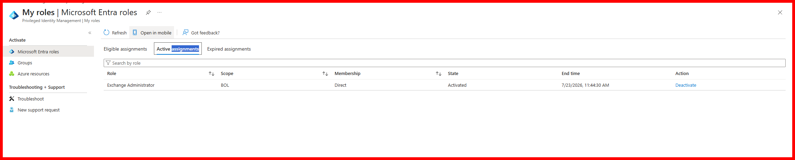

**Verified with real access:** the same account now had full Exchange admin center access — mailboxes, mail flow, roles.

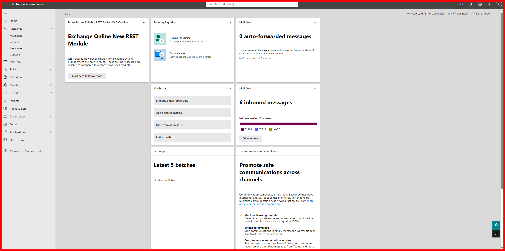

---

## 4.4 — AZ-104: Azure RBAC — Reader role

Assigned built-in **Reader** on `RG-Phase1-Lab` to a test user via Access control (IAM).

> ⚠️ **Unexpected finding:** the assignment landed as **"Eligible time-bound"** instead of Active — this tenant's Entra ID P2 license extends PIM governance to Azure resource role assignments by default, not just Entra directory roles. Had to manually edit the assignment (Assignment type → Active, Permanent) to get a direct, non-PIM assignment.

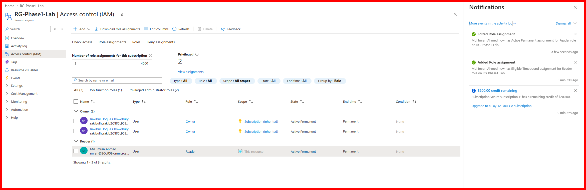

**Verified — could view:** logged in as the assigned user, opened the resource group directly and could see the Overview, tags, and subscription info.

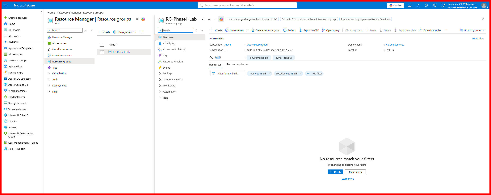

**Verified — could NOT create:** attempted to deploy a VM into the same resource group.

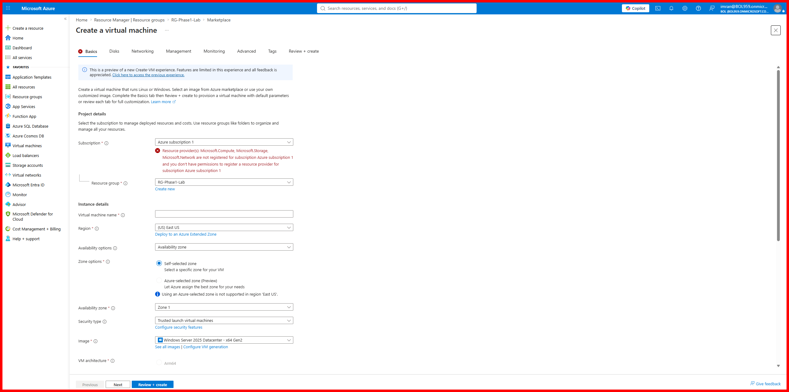
> Blocked with: *"Resource provider(s) ... are not registered ... and you don't have permissions to register a resource provider."* Reader can see everything, write nothing.

---

## 4.5 — AZ-104: Custom RBAC role

Built a custom role, **VM Operator**, with exactly three Actions and nothing else:
- `Microsoft.Compute/virtualMachines/start/action`
- `Microsoft.Compute/virtualMachines/restart/action`
- `Microsoft.Compute/virtualMachines/powerOff/action`

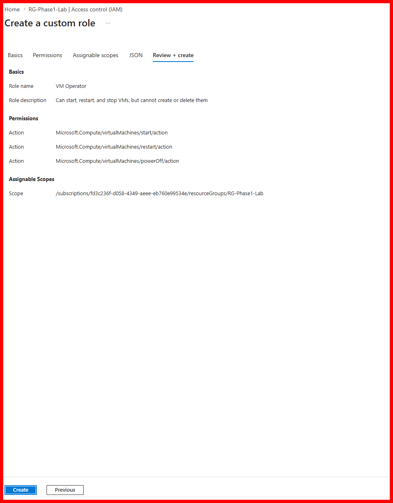

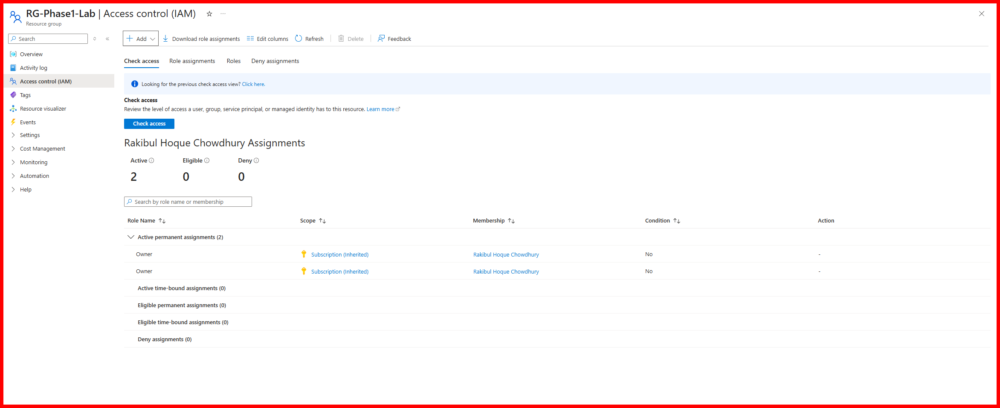

Assigned to a test user on `RG-Phase1-Lab` as Active Permanent (same PIM-default behavior as 4.4 showed up here too, and was corrected the same way).

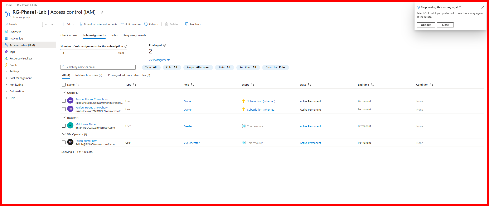

> ⚠️ **Unexpected finding:** the assigned user got a **401** even just navigating directly to the resource group by URL — *"does not have authorization to perform action 'Microsoft.Resources/subscriptions/resourceGroups/read'."* A role built purely from `Microsoft.Compute` actions doesn't implicitly include the generic `resourceGroups/read` permission needed to open the RG blade itself. Unlike built-in Reader (which carries a wildcard read across resource types), a narrowly-scoped custom role needs that permission added explicitly if the user is expected to browse to the resource through the portal rather than act on it via a known path (CLI, automation, etc.).

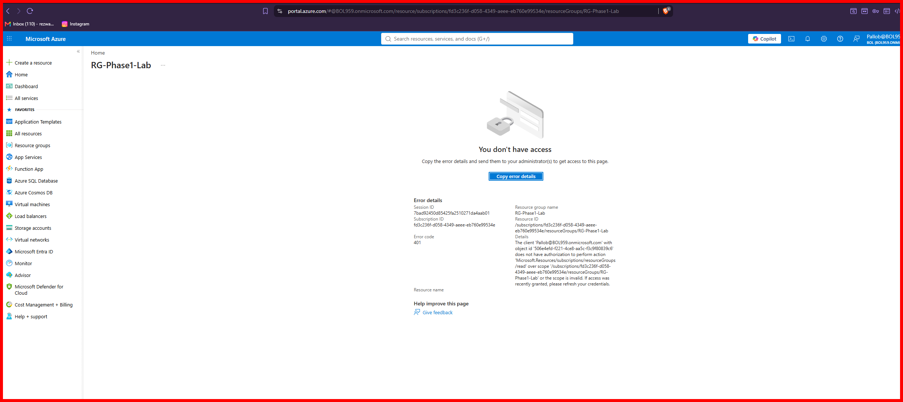

---

## 4.6 — AZ-104: Resource Lock

Added a **Delete** lock on `RG-Phase1-Lab`.

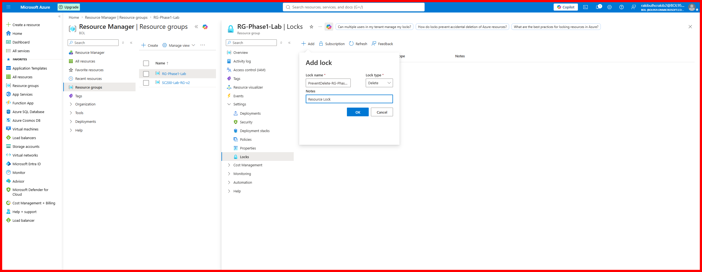

**Verified — even as Owner/Global Admin:** attempted to delete the resource group directly from the same admin account used throughout this project.

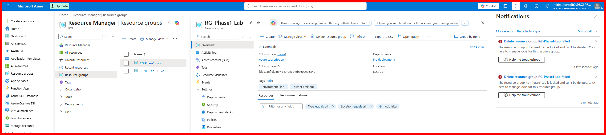
> *"The resource group RG-Phase1-Lab is locked and can't be deleted."* Locks sit above RBAC entirely — no role assignment, however privileged, overrides one.

---

## Mistakes & fixes (quick reference)

| Mistake | Fix |
| --- | --- |
| New Azure role assignments (Reader, custom role) silently landed as "Eligible time-bound" instead of Active | Entra ID P2 extends PIM governance to Azure resource roles by default in this tenant — edited the assignment's Assignment type to Active + Permanent |
| Couldn't find the PIM self-service "Activate" button | It isn't under My Access (entitlement management) — it's under Entra ID → Privileged Identity Management → My roles → Microsoft Entra roles |
| Custom "VM Operator" role couldn't open the resource group blade despite valid VM-level permissions | Narrowly-scoped custom roles don't inherit `Microsoft.Resources/subscriptions/resourceGroups/read` — must be added explicitly if portal browsing is expected |

---

## Key learnings

1. **Least privilege is provable, not assumed** — every role in this project was verified two ways: what it *could* do, and what it explicitly could *not* do.
2. **Scoping restricts visibility, not just actions** — both the Administrative Unit and the custom role showed users/resources disappearing entirely from a scoped admin's view, rather than throwing an access-denied error.
3. **Eligible ≠ Active, and it's easy to get one when you meant the other** — this tenant's PIM-for-Azure-resources default caught out both the Reader and the custom role assignment.
4. **Built-in roles carry implicit permissions custom roles don't** — Reader's wildcard read access vs. a hand-built role needing `resourceGroups/read` spelled out is the clearest AZ-104-relevant gotcha from this project.
5. **A Resource Lock is the strongest guardrail in this whole toolkit** — it's the only control here that held even against the tenant's own Global Administrator / Owner.

---

**Next:** Full roadmap: [`ROADMAP.md`](https://github.com/rakibulhcrafat07/Microsoft-365-Azure-Sentinel-SC200-Lab/blob/main/ROADMAP.md)
